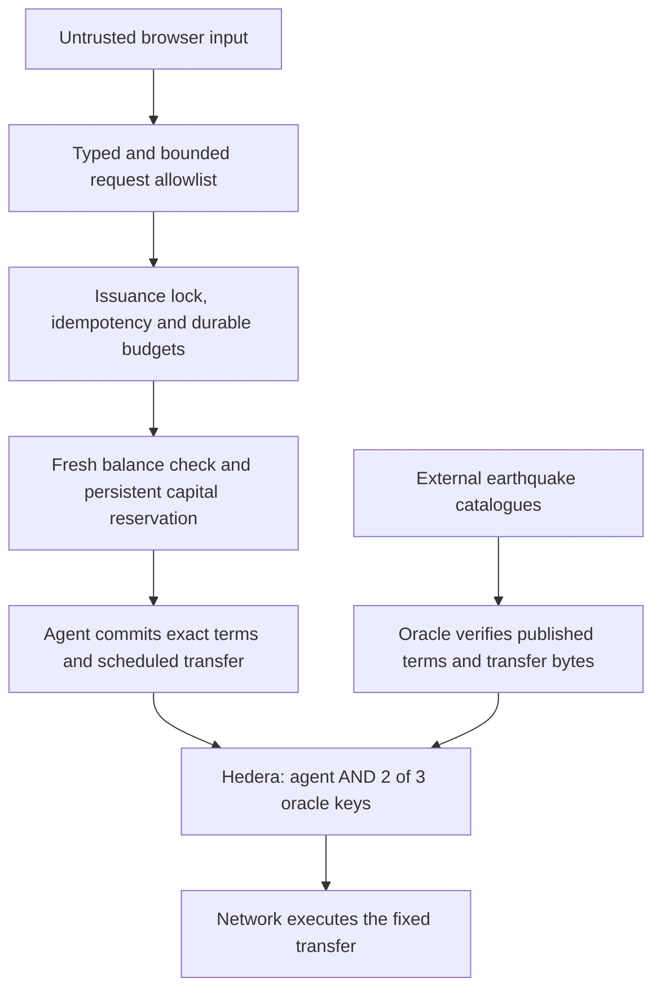

# Aivy Quorum · Earthquake cover

Choose a place. Commit a fixed payout. Two oracle confirmations release it.

Aivy Quorum demonstrates parametric earthquake settlement using native Hedera services.
The agent pre-signs a Scheduled Transaction at issuance. The pool key requires
both the agent and two of three oracle keys. When the missing signatures arrive,
Hedera executes the scheduled transfer without a separate executor transaction.

**Public UI: funded testnet demo.** No user payment is required. Beneficiary
accounts are managed by the service. `aUSDd` is an unbacked demo token with no cash
value; displayed dollars are model outputs. This is a prototype, not live cover.

**Event checks are manual.** The oracle services read catalogues when requested.
Automatic ledger execution does not imply automatic earthquake monitoring.
The story replays controlled signatures from a recorded mainnet transfer.

See [the submission walkthrough](docs/SUBMISSION.md) and [AI assistance disclosure](docs/AI-ASSISTANCE.md).

## Start here, judges

[Open the app](https://quorum.aivylabs.xyz) ·
[3-minute walkthrough](docs/SUBMISSION.md) ·
[Security architecture](docs/AGENT-SECURITY.md) ·
[Implementation and visual audit](AUDIT-IMPLEMENTATION.md)

Security is part of the implementation: authorization, admission budgets and
payment constraints are enforced in code before signing, with the signature
threshold independently enforced by Hedera. The interface exposes evidence on
demand so these checks are inspectable without crowding the primary journey.

| Capability | What actually runs |
| --- | --- |
| Create cover, premium transfer and cover NFT | Funded **Hedera testnet** demo; service-managed beneficiary; `aUSDd` has no cash value. |
| Scheduled settlement story | **Recorded mainnet** demonstration: 4 HBAR executed. Separate authorization controls show 1 HBAR transferred and 5 HBAR blocked. Controlled signatures, not a live earthquake claim. |
| Paid oracle access (x402) | Verified **testnet** payment through our self-hosted facilitator; paying for data does not approve a claim. [Payment evidence](docs/evidence/x402-testnet.json). |
| Uniswap conversion | **Live Trading API quotes** for hypothetical USDC→ETH on Base or Unichain mainnet. No bridge, token approval, wallet signature or swap execution. [Quote evidence](docs/evidence/uniswap-quotes.json). |
| Per-policy funding | **Concept preview** showing contribution, premium share and capital at risk. No per-policy deposit or LP NFT is issued; existing LP primitives use fungible shares in a shared pool. |

## Security by architecture

**The deployed agent is deterministic. No LLM decides, authorizes or signs a
public policy.** A future AI planner must call the constrained policy service
without receiving raw keys, a shell or arbitrary transaction-signing authority.
User input and external catalogue data are treated as data, never instructions.



### Guardrails and where to inspect them

| Protection | Implemented behavior | Source / evidence |
| --- | --- | --- |
| Restricted public authority | Public issuance is testnet-only. Exact input fields, typed coordinates, $1–$50 modeled budget, 7–62 day duration and an 8 KB JSON object limit. A visitor cannot supply a beneficiary, key or arbitrary transaction to issuance. | [HTTP validation](src/http-safety.js), [API routes](src/server.js) |
| Durable spending admission | Default limits: **3 attempts/IP/hour, 100 attempts/rolling 24h, $20,000 modeled cover/rolling 24h**. Consumed before ledger actions; failed or uncertain admitted attempts remain charged. Configuration is validated. Atomic private journal survives restarts; invalid journal pauses writes. | [Budget guard](src/guards.js), [deployed refusal evidence](docs/evidence/agent-guardrails.json) |
| Trustworthy request identity | Forwarding headers are trusted only from a configured loopback proxy, using the final proxy-appended address. Budget records use HMAC-derived IP identifiers; public errors omit internal exception details. | [HTTP safety](src/http-safety.js), [guardrail tests](tests/guardrails.test.js) |
| Capacity and replay protection | Exclusive issuance lock, fresh pool balance and durable reservation before ledger writes. Reusing a request ID does not mint again. Interrupted writes retain reservations and public receipt checkpoints for reconciliation; abandoned locks fail closed. | [Issuance](src/policy/issue.js), [book](src/book.js), [lock](src/issuance-lock.js), [safety tests](tests/safety.test.js) |
| Policy-bound oracle authority | Verifies configured HCS topic, issuer signature, canonical terms hash, time window, network, asset, beneficiary and exact scheduled amount. Rejects extra transfer legs, allowances and unsupported fields. Caller input cannot lower the published trigger; queries are bounded, missing data is not a positive vote, duplicate identities do not become a quorum. | [Policy binding](src/policy/binding.js), [oracle implementation](src/oracle/), [security review](docs/AGENT-SECURITY.md) |
| Ledger-enforced signature gate | The pool requires **agent AND 2-of-3 oracle keys**. Oracle keys alone cannot spend. Signature evidence and observed execution are displayed separately. | [1 HBAR executed control](https://hashscan.io/mainnet/schedule/0.0.10843723), [5 HBAR blocked control](https://hashscan.io/mainnet/schedule/0.0.10843725) |
| Bounded x402 payment authority | Client checks explicitly authorized resource, network, recipient, asset, fee payer and maximum amount before signing; paid redirects and automatic new payments after uncertain responses are refused. Facilitator validates exact payment bodies, rejects extra debits/approvals and excessive fees, and requires a consensus receipt. | [Payment policy](src/x402/payment-policy.js), [facilitator](src/x402/facilitator.js), [payment tests](tests/payments.test.js) |
| Uniswap least privilege | Server selects only a bounded, allowlisted quote operation. API key remains server-side; no EVM private key, approval or broadcast is needed. | [Conversion tests](tests/cross-asset.test.js), [live quote evidence](docs/evidence/uniswap-quotes.json) |
| Runtime and secret isolation | Project listeners bind to loopback behind TLS nginx; environment/registry files use 0600 and artifact directory 0700. Project-specific Node 22 runtime and patched protobuf, WebSocket and gRPC dependencies. Minimal runtime installation omits unrelated automatic peers. | [Operational review and install instructions](docs/AGENT-SECURITY.md#operational-review), [lockfile](package-lock.json) |
| Visible verification | Open a policy → **Agent guardrails & proof** for current limits/usage and recorded authorization controls. Read-only endpoint exposes configuration without keys or IP identifiers. | [Live guardrails](https://quorum.aivylabs.xyz/api/guardrails), [UI implementation](ui/src/app/AgentGuardrails.tsx) |

**Verification recorded September 6, 2026:** 41 offline tests passed locally and
in the isolated VPS runtime, including malformed requests, forged IP headers,
quota persistence/corruption, concurrent issuance, payment substitution, uncertain
payment retry, term binding and duplicate votes. The UI production build passed.
The documented minimal production dependency tree reported zero known advisory
vulnerabilities at that check; this is not proof of vulnerability-free software.

The [deployed guardrail snapshot](docs/evidence/agent-guardrails.json) records an
oversized request refused before reservation or ledger work, with no request
record and unchanged budget. Snapshot usage is historical; the live endpoint
shows current usage. The security review did not create a policy or send a payment.

### What these controls do not guarantee

This is a prototype with hot keys under one VPS/administrative trust domain.
Separate keys and catalogue sources do not mean independent oracle operators.
Agent plus oracle quorum can authorize spending; the ledger key does not encode
all underwriting rules. Capital reservations are off-ledger and assume one
shared authoritative book and lock. External spending can invalidate capacity.

Real customer value requires independent key administration, managed/HSM signing
with transaction policies, authenticated customer/funding actions, perimeter
limits and alerting, recovery/backups, and transactional storage before scaling
across hosts. The x402 facilitator has no production fee-sponsorship abuse budget
or automatic refund system. **No independent security audit or production
readiness is claimed.** See the [full threat boundaries](docs/AGENT-SECURITY.md)
for the architecture rationale and remaining work.

## Run locally

Use Node 22 or newer.

```sh
npm ci
# Configure .env from .env.example. Provisioning spends testnet assets:
npm run provision
npm run serve
# In another terminal:
cd ui
npm ci
npm run dev
```

Open http://localhost:5173. Vite proxies `/api` to the local API on port 8791.
The API binds to localhost by default and refuses public mainnet issuance.
For hosting, serve the UI with an SPA fallback and proxy `/api` to the backend,
or build with `VITE_AGENT_URL` pointing to its HTTPS origin. Set `HOST` for the
intended interface and `TRUST_PROXY=1` only behind a trusted reverse proxy.

## Design: simple to use, possible to verify

The primary journey has three destinations: **Cover**, **Policies**, and
**How it works**. Details expand where they are relevant. The goal is minimal
primary copy with visible scope and risk, rather than hiding qualifications.

| Improvement | What the visitor sees / why it matters |
| --- | --- |
| Global discovery | Debounced Photon/OpenStreetMap city and municipality search, keyboard selection, coordinate entry, map pinning, zoom/pan, and Mexico, California and Tokyo demos. Unaccented “Medellin” was verified. Search coverage depends on the upstream catalogue. |
| Geographic NFT identity | Aivy Quorum branding, local map, approximate 100 km protected area, terms, payout and network replace abstract artwork. Cover NFTs and proposed LP receipts remain visually distinct. |
| Understandable pricing history | Premium-over-time chart holds the modeled payout at **$800**, with the selected year and red/green annual variation. Click, tap or drag the chart—or use the keyboard/timeline—to choose a year. Historical exploration cannot change issued terms; returning to Cover restores the current M6+ quote. |
| Visual funding preview | Contribution slider, premium share and two claim outcomes show how capital might participate. Annual premium rate is gross, before claims/costs; contributed principal can be used for a payout. Formula and assumptions expand on demand. Preview/unminted labels remain visible. |
| A clearer six-scene story | Geographic terms → capital commitment → named signatures → transfer animation → NFT/receipts → blocked authorization control. Direct step links and previous/next controls keep the recorded mainnet demonstration navigable. |
| Explicit signature evidence | Old circular diagrams were replaced with **agent key AND oracle threshold → observed result**. “3 signed · 2 required” avoids ambiguous counts. Missing agent signature explains the blocked control; unknown ledger status remains unverified. |
| Quiet blockchain visibility | Optional Onchain/Verify panel and contextual receipt links expose NFT mint/delivery, transfers, agent/oracle actions and x402 evidence. Testnet, recorded mainnet, live API quotes and proposed funding are labeled separately. Unknown or invalid policies do not borrow another policy's receipts. |
| Optional Uniswap detail | “Payout in ETH? · Uniswap” expands to network, quote ID, timestamp/expiry, refresh, estimated gas and route evidence. A real quote is visible without implying redemption or a completed swap. |
| Recovery and navigation | Saved request IDs, interrupted-request review, honest loading/refusal/offline states and retry links. Location persists on refresh, gallery filters survive detail round trips, invalid routes offer recovery, and “Created here” means this browser—not wallet ownership. |
| Responsive and accessible controls | Mobile layouts stack; story navigation remains accessible; maps/charts have text descriptions, controls support keyboard use, focus is visible for keyboard interaction, and reduced-motion preferences are respected. Recent reviews covered 320 px mobile through desktop without horizontal overflow in the checked flows. |

The [implementation audit](AUDIT-IMPLEMENTATION.md) records the delivered changes
and checks; the [recording-readiness review](docs/FINAL-UX-REVIEW.md) covers the
end-to-end demo. The latest visual review checked the active Cover, Policies,
NFT/LP, historical chart and story illustration paths. Legacy ring components in
unrouted source files are not used by the active app. These are documented
browser checks, not a claim of exhaustive device or accessibility certification.

## What is demonstrated

The nested key is `AND(agent, 2-of-3 oracle keys)`. The oracle quorum alone cannot
spend from the pool. The agent and quorum together still control it: this is a
specific authorization restriction, not protection from their collusion.

The oracle adapters use USGS, EMSC and GEOFON data. The demo operates those
services; source names do not mean those institutions operate our signing keys.
Separate processes and data sources do not establish independent operators.

Before signing, an oracle binds the configured HCS policy topic, recorded terms,
issuer signature, memo hash, network, expiry, asset, beneficiary and amount to
the actual scheduled transfer. Legacy recordings require manual verification.
The x402 facilitator accepts only the exact payment transfer and refuses extra
legs, facilitator debits, approvals, unsupported fields and excessive fees.

The policy NFT points to HCS terms. Premium transfers can include a broker split
in the same transaction. Cross-asset support returns an optional quote; it does
not bridge or execute an EVM payout.

## Pricing and capacity

A first-order Poisson model estimates shallow M6+ frequency over a 300 km
reference region, scales to the fixed 100 km trigger circle, and adds uncertainty
loading. It is reproducible, not actuarial-grade. A location without qualifying
historical data is declined; no record does not establish zero risk.

The payout requires M6+, distance ≤100 km, depth ≤70 km, and an event inside the
coverage window. Damage alone does not qualify. Terms last 7–62 days; late event
reporting or missing oracle service can prevent timely signatures.

The local issuance book reserves aggregate promised payouts before ledger writes,
under an exclusive filesystem lock. Issuance is refused when existing promises
plus the request exceed available capital. These are off-ledger reservations:
funds are not individually escrowed per schedule, and external spending can
invalidate capacity. Multiple instances must share the same book and lock;
independent disks are unsupported. Issuance admission limits are persisted in the
shared private journal; restarting the process does not reset them.

## Interrupted requests

The browser saves a random request identifier before creation. Policies checks
`GET /api/requests/:id`; completed requests resolve to the issued policy and
interrupted requests remain visible for review. Replaying an identifier never
creates another policy. Issuance checkpoints retain public ledger identifiers.

A failed issuance retains its capital reservation. A crashed process can leave
`.artifacts/issuance-<network>.lock`; subsequent issuance fails closed. An operator
must verify that the writer has stopped, inspect the reservation and its HCS,
NFT, premium and schedule receipts, and reconcile the book before removing the
lock or releasing capacity. Never blindly delete a reservation: the ledger write
may have succeeded even when its response was lost. Back up the book first.

## Verification

```sh
npm test                 # offline pricing, authorization, payment and issuance tests
npm --prefix ui run build
```

The reusable plugin has its own tests in the sibling repository:

```sh
cd ../hak-scheduled-settlement
npm test
npm run typecheck
npm run build
```

`d1`, `d2`, `d3`, and `verify-quorum.js` are controlled HBAR ledger demonstrations,
not offline tests. They spend network assets and update `.artifacts` and
`LINKS.md`. They are separate from the current app's token issuance flow; d3
submits controlled signatures rather than verifying a real earthquake. Run in an
isolated checkout with separate demo accounts if reproducing the historical run.
The UI's frozen mainnet record is not replaced automatically.

## Prior work boundary (CONTINUITY track)

**Everything in this repository was written during ETHOnline 2026 (from
2026-09-04).** The repo has no pre-event commits.

What existed before the event, and does **not** count as new work:

- **[aivy-studio](https://github.com/jmgomezl/aivy-studio)** — the multi-agent
  orchestration canvas this project is built to run on. Existing HCS-10 transport,
  HTS escrow, workflow schema, canvas rendering.
- **[jmgomezl/aivy](https://github.com/jmgomezl/aivy)** — earlier APEX-hackathon app.
- **hak-saucerswap-plugin, hak-pyth-plugin** — endorsed third-party plugins in the
  Hedera Agent Kit docs.
- **hak-uniswap-plugin** — Uniswap Trading API plugin with allowance handling and a
  Ledger threshold gate, proven on Sepolia. Reused here for live USDC-to-ETH
  conversion quotes on Base and Unichain. The UI does not bridge or execute swaps.
- **Aivy Settlement Layer (ETHGlobal Lisbon, July 2026)** — a prior continuity
  build on aivy-studio that also used HTS pools and Scheduled Transactions. The
  overlap is the *substrate*; what is new here is stated below.

What is **new**, built during this event:

1. **Signature-gated conditional settlement** — payout as a pre-signed Scheduled
   Transaction whose trigger is oracle-quorum signature accumulation, with the
   nested `and(agent, k-of-n)` key that enforces the signature restriction. Extracted as
   [hak-scheduled-settlement](https://github.com/jmgomezl/hak-scheduled-settlement),
   a Hedera Agent Kit plugin this repo consumes, rather than left inside the app.
   Building it surfaced a gap in the kit itself — account creation cannot express
   a multi-signature key — filed as
   [hedera-agent-kit-js#1087](https://github.com/hashgraph/hedera-agent-kit-js/issues/1087)
   and fixed in the open PR
   [#1088](https://github.com/hashgraph/hedera-agent-kit-js/pull/1088).
2. **A hazard-priced underwriting agent** — premiums derived live from the USGS
   catalogue for any lat/lon on earth, with published inputs.
3. **An issuance capacity guard** reserving aggregate exposure against available capital in the shared book. External spending can invalidate this off-ledger reservation.
4. **Atomic premium settlement with an open broker channel** — buyer, pool and an
   arbitrary per-sale broker settled in one multi-party transaction.
5. **x402-gated oracle services** — the oracle agents are the paid service, not
   just consumers of one.

## Layout

- `src/policy/`: pricing-to-issuance flow, HCS terms, NFT and scheduled transfer.
- `src/oracle/`: catalogue adapters, event checks and policy-bound signing.
- `src/x402/`: exact payment verification, settlement and client.
- `src/book.js`, `src/issuance-lock.js`: durable reservations and serialization.
- `src/guards.js`, `src/http-safety.js`: durable admission budgets and public input validation.
- `docs/AGENT-SECURITY.md`, `docs/evidence/`: trust boundaries and verifiable snapshots.
- `src/ledger.js`: shared policy status from actual signer identities.
- `ui/`: map, quotes, policies and recorded demonstration.
- `deploy/`: oracle deployment configuration.
- `research/`: model rationale and historical integration notes.
- `LINKS.md`: historical ledger artifacts.

MIT.
