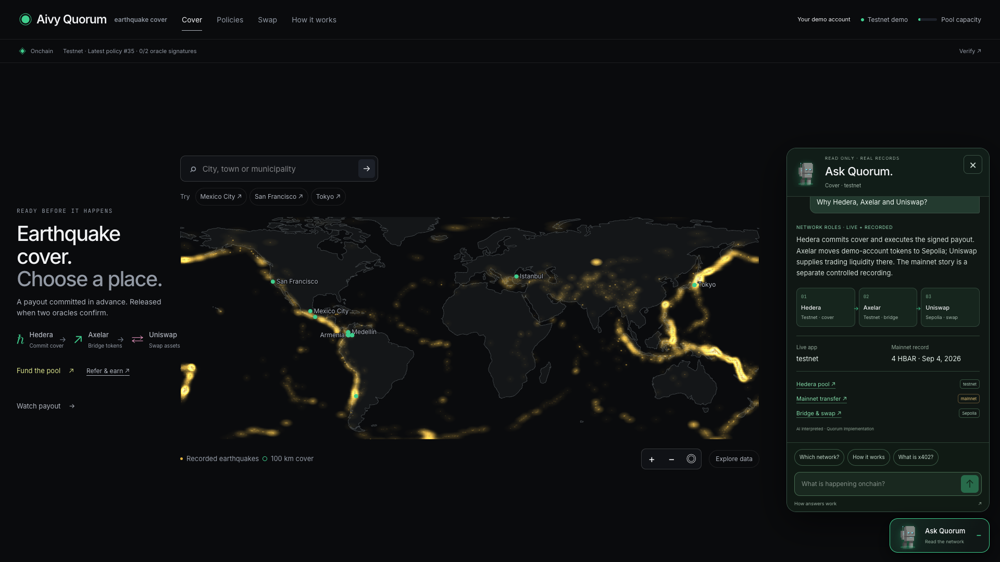
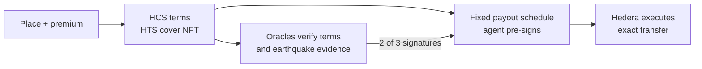
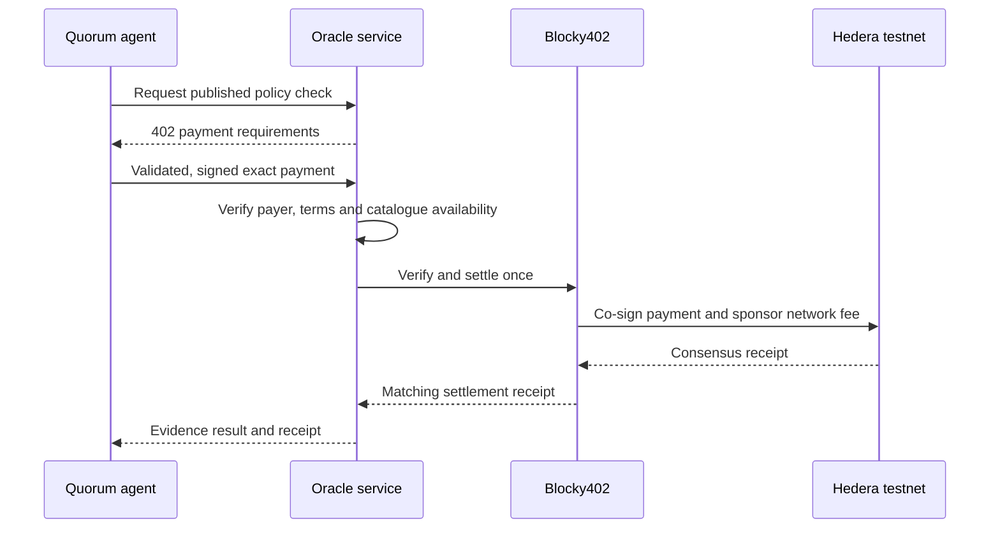
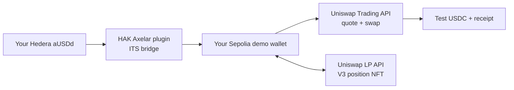

# Aivy Quorum · Earthquake cover

**Choose a place. Commit the payout. Verify every step.**

After an earthquake, a small business may need cash before it can finish a claim.
Quorum explores a simpler promise: agree on a measurable trigger and payout in
advance, then let verified signatures release that exact transfer on Hedera.

[**Try Quorum →**](https://quorum.aivylabs.xyz) · [Monthly cover agent](https://aivylabs.xyz/quorum) ·
[Bridge & swap](https://quorum.aivylabs.xyz/swap) · [Demo film and script](https://quorum.aivylabs.xyz/demo-video/)

**Judge shortcuts:** [Hedera](#why-hedera) · [Uniswap](#why-uniswap) ·
[Evidence](#verify-in-one-minute) · [Security](#security-by-architecture) ·
[New vs. reused](#what-is-new) · [Setup](#run-locally)



**Real testnet transactions, funded demo accounts, no wallet extension.**
Demo tokens have no cash value. The mainnet payout is a labeled historical
experiment.

## Try the business model

| Try | Where | What actually happens |
| --- | --- | --- |
| **Buy cover** | Search “Medellin” → choose budget → create cover | Premium transfer, published terms, cover NFT and pre-signed payout schedule on Hedera testnet. |
| **Check an event** | Policy → **Check for earthquakes** | Three catalogue requests paid through **Blocky402**; matching evidence may authorize oracle signatures. |
| **Set monthly rules** | [Aivy Labs canvas](https://aivylabs.xyz/quorum) → review → activate | A deterministic worker buys within an approved budget, for up to three periods. |
| **Reach Uniswap** | [Swap](https://quorum.aivylabs.xyz/swap) → **Bridge / Swap** | Actual Hedera → Axelar → Sepolia transfer and Trading API swap. Starter tokens also allow an immediate swap. |
| **Provide liquidity** | Swap → **Provide swap liquidity** | Real Uniswap V3 NFT, add liquidity, collect fees and withdraw. |
| **Fund or refer** | **Fund the pool** / **Refer & earn** | Shared-pool ARPS deposit or a referral link paying 15% of a referred premium. |

Ask the companion about a policy or network. **AI interprets the question;
trusted code reads the facts. Chat cannot buy, sign or move funds.**
[Business flows](docs/INTERACTIVE-BUSINESS-FLOWS.md) · [Current review](docs/qa/SUBMISSION-REVIEW.md).

## Why Hedera

**The promise is a native Scheduled Transaction.** Its fixed asset, amount and
beneficiary are committed at issuance. The pool's key requires **agent AND two
of three oracle keys**; Hedera executes when those signatures are present.



| Component | Why it belongs here | Inspect |
| --- | --- | --- |
| **Scheduled Transactions + nested keys** | Encode the fixed-transfer authorization without our own settlement contract or a final keeper transaction. | [Payout](src/policy/payout.js) · [Reusable HAK plugin](https://github.com/jmgomezl/hak-scheduled-settlement) |
| **HCS** | Publish terms and hash-bind them to the transfer each oracle verifies. | [Terms](src/policy/terms.js) · [Binding](src/oracle/verify-policy.js) |
| **HTS** | Cover receipt NFT, demo settlement asset, atomic premium/broker split and ARPS shares. | [NFT](src/policy/collection.js) · [Premium](src/policy/purchase.js) |
| **Mirror Node** | Read actual signatures, NFT ownership, balances and receipts for the UI and companion. | [Reader](src/ledger.js) · [Verification](docs/MIRROR-NODE.md) |
| **Blocky402 + x402** | Pay per policy-bound oracle request, without an oracle subscription or API key. | [Payment flow](docs/BLOCKY402.md) · [Consumer](src/demo/policyChecks.js) |



**0.001 aUSDd per source; up to 0.003 per check.** Three
[confirmed Blocky402 payments](docs/evidence/blocky402-testnet.json) returned
**no match**, so they produced no oracle signature or payout. Payment buys an
evidence check, not claim approval. [Live services, setup and receipts](docs/BLOCKY402.md).

Event checks are requested from the policy page; no background earthquake
monitor is deployed. The ledger enforces signatures, not earthquake truth.

## Why Uniswap

**A Hedera-native application reaches EVM liquidity through APIs.**
Axelar transports the demo asset; Uniswap routes its swap and manages trading
positions. Quorum validates the prepared transactions before its scoped demo
signer executes them. No custom Solidity swap contract was added.




| Integration | Exact implementation / contract |
| --- | --- |
| Trading API `/quote` + `/swap` | [API calls](https://github.com/jmgomezl/aivy-parametric-pool/blob/47aa2f72af3c2f26658276418254533a91fe9e5c/src/settlement/bridgedSwap.js#L40) · [calldata and Permit2 checks](src/settlement/bridgedSwap.js#L14) |
| LP API: create, increase, collect, remove | [API adapter](https://github.com/jmgomezl/aivy-parametric-pool/blob/47aa2f72af3c2f26658276418254533a91fe9e5c/src/settlement/liquidity.js#L79) · [validation](src/settlement/liquidity.js#L44) |
| Sepolia aUSDd / test USDC · 0.3% pool | [Pool contract](https://sepolia.etherscan.io/address/0x520388428673bc16fad5aa5e49fdb1d30727ceb3) · [position manager](https://sepolia.etherscan.io/address/0x1238536071e1c677a632429e3655c799b22cda52) |
| Execution and allowances | [Universal Router](https://sepolia.etherscan.io/address/0x3a9d48ab9751398bbfa63ad67599bb04e4bdf98b) · [Permit2](https://sepolia.etherscan.io/address/0x000000000022d473030f116ddee9f6b43ac78ba3) · [scoped signer](src/demo/evm.js) |

**Verified:** [bridged-token swap](https://sepolia.etherscan.io/tx/0xdcd06bd9aeb5a0fb33ac54aaf2f3b82f69e18ae554e76a3892fcbacaeb6420a6) ·
[V3 NFT mint](https://sepolia.etherscan.io/tx/0x156128aef98952488fdd34174fa300bfe35be0a50cdb68fad31aa4927283989c) ·
[fee collection](https://sepolia.etherscan.io/tx/0xb190fc08ba9686ef4ac0a4b9f4e0b3009ab7dc2820eeeb5c9063f6b9c6d04634) ·
[full lifecycle](docs/evidence/uniswap-liquidity.json).

Starter tokens come from previously bridged sponsor inventory. They do not prove
that the visitor's new bridge has completed. Mainnet Base/Unichain prices are
**quote-only**; execution here is Sepolia. [Networks, assets and limits](docs/CROSS-CHAIN-VERIFICATION.md).

### Built with our HAK Axelar plugin

Our pre-existing [`hak-axelar-plugin` 1.0.1](https://github.com/jmgomezl/hak-axelar-plugin)
builds each new Hedera ITS transfer with `axelar_send_token`. Quorum adds exact
contract/token/recipient checks, a tested native-gas unit correction and a durable
transaction journal before signing. The guarded integration is event work;
the plugin itself is prior work.
[Adapter](src/settlement/axelarPlugin.js) · [Package-level tests](tests/axelar-plugin.test.js) ·
[Delivered transfer](docs/evidence/hak-axelar-plugin.json).

[Uniswap developer feedback](FEEDBACK.md) · [Prize requirements and remaining steps](docs/SUBMISSION.md#partner-prize-fit).

## Two pools, two purposes

| | **Fund cover** | **Provide swap liquidity** |
| --- | --- | --- |
| Network | Hedera testnet | Ethereum Sepolia |
| Receipt | Fungible **ARPS** shares | **Uniswap V3 position NFT** |
| Capital supports | Conditional earthquake payouts | aUSDd ↔ test USDC trades |
| Earnings / exit today | **Not implemented** for ARPS | Swap-fee collection and liquidity withdrawal |

Policy funding cards are **economic previews**, not individual vaults or issued LP
NFTs. ARPS deposits back the shared pool and cannot select a policy. A percentage
of shares is not an APY. Test liquidity is not a USD peg or redemption promise.
[Worked economics and risks](docs/ECONOMIC-MODEL.md).

**Commercial direction · proposed:** provide issuance and verifiable settlement
to insurers and brokers, funded by partner subscriptions and per-policy service
fees. Today, no platform fee is collected. Next: validate one regional partner
pilot, risk calibration, customer demand and operating costs.
[Business hypothesis](docs/SUBMISSION.md#business-model-proposed).

## Connected to Aivy Labs

**“Cover Medellín every month, within my budget.”** The dedicated
[Aivy canvas](https://aivylabs.xyz/quorum) turns explicit spending rules into a
persistent Quorum purchase mandate. Up to three periods; pause at any time.


Real example: [policy #34](https://quorum.aivylabs.xyz/policy/34), **10 aUSDd premium
→ 1,398.89 aUSDd conditional payout**. Its first purchase is verified; later
renewals are planned attempts, not completed transactions. Both companions answer
from scoped records and receipt links. **Neither chat can change a mandate.**

[Worker and custody](docs/COVER-AGENT.md) · [Companion guardrails](docs/COMPANION.md) ·
[Aivy source](https://github.com/jmgomezl/aivy/blob/main/src/components/QuorumCanvas.tsx) ·
[Verified interaction](docs/demo-video/EVIDENCE.md).

## Verify in one minute

| Evidence | Open | What it proves |
| --- | --- | --- |
| **Testnet cover** | [Policy #34](https://quorum.aivylabs.xyz/policy/34) · [HCS, NFT and premium checks](docs/evidence/mirror-node-review.json) | Terms, beneficiary, NFT pointer and exact committed payout match. |
| **Testnet paid data** | [Blocky402 receipts](docs/BLOCKY402.md#verified-live--september-8-2026) | Three paid catalogue requests; no-match outcomes did not authorize payout. |
| **Testnet bridge and swaps** | [Cross-chain receipts](docs/evidence/cross-chain-testnet.json) · [managed-wallet lifecycle](docs/evidence/managed-wallet-demo.json) | Actual transfers, approvals, swap and position operations. |
| **Recorded mainnet release** | [4 HBAR transfer](https://hashscan.io/mainnet/transaction/1788563478.715401105) | Controlled signatures caused the scheduled transfer to execute. |
| **Recorded blocked control** | [Oracle-only schedule](https://hashscan.io/mainnet/schedule/0.0.10843725) | Oracle keys without the agent signature could not release that transfer. |

Mainnet footage is a **September 4 controlled experiment**, not a real earthquake
claim or proof of independent operators. Each video action is mapped to its
[receipt and editing boundary](docs/demo-video/EVIDENCE.md).

## Security by architecture

**AI explains. Deterministic code authorizes. Ledger keys enforce signatures.**

| Boundary | Guardrails / source |
| --- | --- |
| User or model input | Typed allowlists, scoped topics and owner-bound account reads. [HTTP](src/http-safety.js) · [Companion](src/companion/quorum.js) |
| Issuance | Durable budgets, fresh capacity, reservations and a kernel lock. Same request ID cannot mint twice. [Guards](src/guards.js) · [Issuance](src/policy/issue.js) |
| Oracle signing | Published HCS terms must match the exact schedule, asset, amount, beneficiary and conditions. Extra transfer legs and duplicate identities are rejected. [Verifier](src/oracle/verify-policy.js) |
| x402 / EVM | Exact payments and approvals, pinned networks/contracts, recipient and slippage checks; journal before broadcast. Uncertain operations retain their original transaction. [Blocky402](docs/BLOCKY402.md) · [Managed wallets](docs/MANAGED-DEMO-WALLETS.md) |
| Ledger reads | Filtered token balances, exact large integers, SDK entity normalization; missing/indexing data stays unverified. [Reader and tests](docs/MIRROR-NODE.md) |

**Limits remain visible:** [runtime guards](https://quorum.aivylabs.xyz/api/guardrails).
The demo uses service-managed hot keys on one VPS. Separate keys are **not**
independent operators. Capacity reservations are off-ledger; no independent audit
or production readiness is claimed. [Full security architecture and remaining work](docs/AGENT-SECURITY.md).

## What is new

The contribution connects **hazard pricing → a fixed obligation → paid,
policy-bound verification → native scheduled execution**, then exposes the
result through geographic receipts, constrained agents and an EVM liquidity path.

| Reused before this event | Built for this event |
| --- | --- |
| Earlier Aivy app, orchestration infrastructure and robot art | Dedicated monthly-cover canvas, persistent purchase worker and read-only companions |
| Earlier HTS pools and Scheduled Transaction experiments | Extracted conditional-settlement HAK plugin, policy-bound oracle signatures, issuance and recovery guards |
| HAK Uniswap and Axelar plugins | Guarded cross-chain adapters, funded demo wallets, Trading API swaps and V3 liquidity lifecycle |
| Existing earthquake catalogues and geographic data | Hazard-price model, global search, geographic NFTs, interactive $800-payout premium history |
| Our pre-existing Mirror Node developer skill | September 10 read-path hardening and public verification |

### Prior work boundary (CONTINUITY track)

[**Full disclosure, repositories and event history →**](docs/PRIOR-WORK.md)
Quorum's history starts September 4, 2026. Earlier work is credited explicitly;
we do not claim to invent parametric insurance or multisignatures.

**Upstream:** [reusable settlement plugin](https://github.com/jmgomezl/hak-scheduled-settlement) ·
[Agent Kit nested-key PR #1088](https://github.com/hashgraph/hedera-agent-kit-js/pull/1088) ·
[our Mirror Node skill PR #16, applied as development guidance](docs/MIRROR-NODE.md).
Both PRs were open at the September 10 review. [AI assistance disclosure](docs/AI-ASSISTANCE.md).

## Design: understand first, inspect deeper

Maps show the protected area. The draggable history chart holds the modeled
payout at **$800** and reveals yearly premium changes. Network badges and receipt
links make evidence available without crowding the main flow. Mobile layouts,
keyboard focus and reduced motion are covered in the documented reviews.
[Full design improvements](docs/DESIGN.md) · [Current screenshots and GIFs](docs/media/README.md).

## Run locally

Node **22+**, Git, Python 3 and a C++ build toolchain (`fs-ext` uses native locking).

```sh
git clone https://github.com/jmgomezl/aivy-parametric-pool.git
cd aivy-parametric-pool
# Allow the lockfile's public GitHub dependencies without SSH authentication.
GIT_CONFIG_COUNT=1 GIT_CONFIG_KEY_0=url.https://github.com/.insteadOf \
  GIT_CONFIG_VALUE_0=ssh://git@github.com/ npm ci
npm --prefix ui ci
npm test
npm --prefix ui run build
```

These tests use fixtures and temporary journals; they submit no transactions.
For a running local cover service, configure a funded **Hedera testnet** operator:

```sh
cp .env.example .env  # Fill in your own testnet operator ID, key and key type.
npm run provision    # Creates testnet assets and performs a demo pool deposit.
npm run serve        # API: http://localhost:8791
# In another terminal:
npm --prefix ui run dev  # UI: http://localhost:5173
```

A fresh cover deployment does not reproduce all hosted services automatically.
[Oracle setup](deploy/README.md), [managed Sepolia wallets](docs/MANAGED-DEMO-WALLETS.md)
and [cross-chain setup](docs/CROSS-CHAIN-VERIFICATION.md) need their own configuration.
`UNISWAP_API_KEY` enables API preparation; `OPENAI_API_KEY` enables AI topic
interpretation. Keys stay server-side. [Pricing, recovery and development](docs/DEVELOPMENT.md).

**Validation:** [current submission review](docs/qa/SUBMISSION-REVIEW.md) ·
[automated checks](https://github.com/jmgomezl/aivy-parametric-pool/actions/workflows/check.yml).
[MIT license](LICENSE).
