# Aivy Quorum · Earthquake cover

**Choose a place. Fix the payout. Let verified signatures release it.**

A parametric earthquake-cover prototype: a deterministic agent prices and commits
a payout; oracle keys verify the event; Hedera executes the pre-signed transfer
when its signature requirements are met. **Hedera-native cover meets Uniswap
liquidity through agent APIs—without our own Solidity contracts.** Bridge demo
aUSDd with Axelar, then swap or provide liquidity on Uniswap Sepolia.
**No wallet extension needed:** each browser gets a separate funded demo wallet.
Transactions are real; test tokens have no cash value.

[Try the demo](https://quorum.aivylabs.xyz) · [Bridge & swap](https://quorum.aivylabs.xyz/swap) · [Watch the mechanism](https://quorum.aivylabs.xyz/story) · [Recording guide](docs/SUBMISSION.md)

**Judge shortcuts:** [Hedera](#why-hedera) · [Uniswap](#why-uniswap) ·
[Novelty](#what-is-new) · [Security](#security-by-architecture) · [Evidence](#verify-in-one-minute)

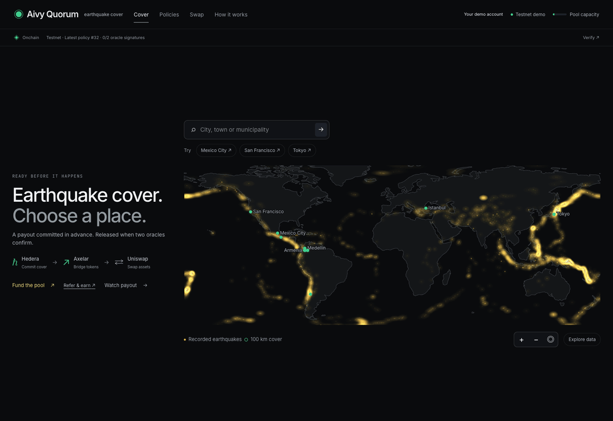

*Current UI · September 8, 2026. Choose a place → explore its premium history →
inspect existing testnet cover NFTs. [Screenshot and recording notes](docs/media/README.md).*

> Public cover is a **funded testnet demo**. `aUSDd` has no cash value; dollars are
> model outputs. Request event checks from a policy page. Mainnet settlement is a
> labeled recording; per-policy funding is a preview.

## Try the business model

| Role | Click | Real testnet outcome |
| --- | --- | --- |
| Buyer | **Your demo account → Start**, then choose a place and **Pay premium & create cover** | 1,000 starter aUSDd; actual premium debit, NFT receipt and scheduled payout. |
| Cover funder | **Fund the pool → Deposit into shared pool** | Tokens enter the shared insurance pool; ARPS shares arrive atomically. Balance and receipt update. |
| Swap liquidity provider | **Swap → Provide swap liquidity** | Create a real Uniswap V3 NFT, add tokens, collect swap fees and withdraw the position. |
| Policyholder | **Policy → Check for earthquakes** | Three policy-bound oracle requests, up to 0.003 test aUSDd via **Blocky402 x402**; qualifying signatures can release the scheduled payout. |
| Broker | **Refer & earn → Copy referral link** | Buyer pays the same premium; 15% goes to the broker and 85% to the pool. Commission history is visible. |

[Verified business flows](docs/qa/PLATFORM-QA.md) · [Current QA and judge review](docs/qa/JUDGE-REVIEW.md) · [UX review](docs/qa/READINESS-REVIEW.md).

**Made for a quick visual demo:** on large screens, the world map sits beside the
introduction, then beside the selected quote and history. Labels stay readable
and the heat layer adapts to display density. The map fits short, wide windows;
search stays in place and zoom controls leave the geography clear.
An animated map crosshair gives subtle hover and drag feedback, with native
cursors retained for reduced motion and high contrast.
[Desktop, ultrawide and mobile checks](docs/qa/LARGE-SCREEN-MAP.md).

No referral means 100% of the premium goes to the pool. There is no separate
platform fee. Shared insurance-pool shares use demo 1:1 issuance, not NAV pricing;
ARPS withdrawals and income distributions are not implemented. Per-policy cards
remain economic previews with term, 30-day and yearly claim/no-claim scenarios.

[Business flows and custody](docs/INTERACTIVE-BUSINESS-FLOWS.md) ·
[Verified deposit, purchase and commission receipts](docs/evidence/business-flows.json).

## The problem and the improvement

Parametric cover replaces damage assessment with a measurable trigger. A remaining
engineering problem is connecting **the promised terms, event verification and
payment authority** so a reviewer can check what was actually authorized.

| Question | Quorum's implementation |
| --- | --- |
| What was promised? | Fixed beneficiary, asset, amount and earthquake conditions, published to HCS and linked from a cover NFT. |
| Who may release it? | Agent **AND** two of three oracle keys; each oracle checks terms against the actual scheduled transfer. |
| Who sends the final payout? | Hedera executes when required signatures arrive; no separate keeper/executor transaction for this transfer. |
| Can the asset reach EVM liquidity? | Bridge demo aUSDd through Axelar, then trade it through Uniswap on Sepolia. This uses the visitor’s demo balance; the policy beneficiary is separate. |

## Why Hedera

**The obligation is a native Scheduled Transaction.** Hedera's scheduling and
nested keys directly express the fixed-transfer authorization this prototype
needs; the payout path does not require a custom settlement smart contract.

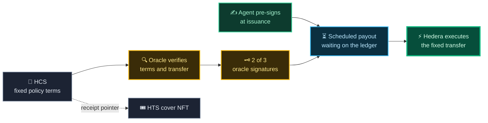

> The payout needs no keeper: it already carries the agent’s signature, and
> Hedera executes when the quorum completes. Event checks still need to be
> requested; this demo does not run an autonomous earthquake monitor.

| Component used | Why it fits | Implementation |
| --- | --- | --- |
| **Scheduled Transactions + nested KeyList/ThresholdKey** | Prepare the exact payout now; release it only with agent + oracle quorum authorization. | [Payout](src/policy/payout.js), [reusable settlement plugin](https://github.com/jmgomezl/hak-scheduled-settlement) |
| **Hedera Consensus Service (HCS)** | Publish ordered policy terms; hash-bind them to the schedule so oracles verify the same obligation. | [Terms](src/policy/terms.js), [binding](src/policy/binding.js) |
| **Hedera Token Service (HTS)** | Issue a cover receipt NFT and transfer the demo settlement token; premium and broker split can settle atomically. | [NFT](src/policy/collection.js), [premium transfer](src/policy/purchase.js) |
| **Mirror Node + HashScan** | Read actual signer/transaction evidence and let judges independently inspect receipts. | [Ledger reader](src/ledger.js), [recorded evidence](ui/src/data/mainnet.json) |
| **Hedera Agent Kit plugin** | Extract the scheduling primitive for reuse beyond this earthquake UI. | [Dependency](package.json), [plugin repository](https://github.com/jmgomezl/hak-scheduled-settlement) |

**Boundary:** the ledger enforces signatures, not earthquake truth or every
underwriting rule. Oracle software checks conditions. Separate keys on our demo
host do not prove independent operators.

## Why Uniswap

[Developer feedback](FEEDBACK.md) · [Prize requirements and remaining submission steps](docs/SUBMISSION.md#partner-prize-fit)

**A Hedera-native application can reach Uniswap liquidity without custom Solidity.**
Cover settles through Hedera. Axelar ITS moves the demo asset to Sepolia; the
Uniswap Trading API finds its route and prepares a guarded swap for an isolated funded demo wallet.
The user can keep the same application open throughout.

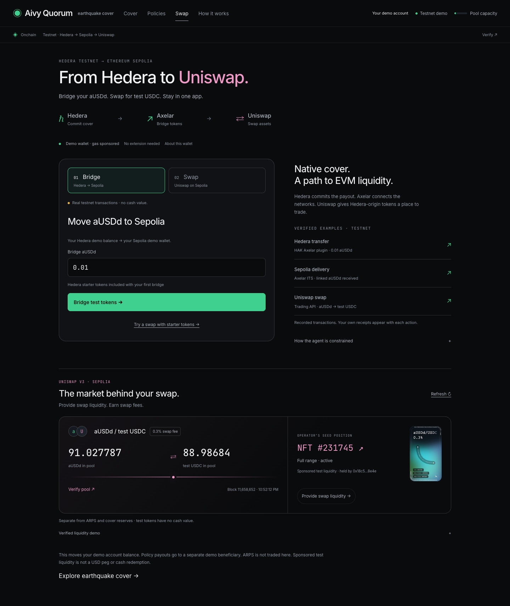

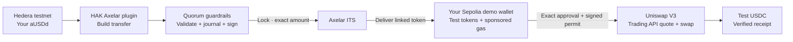

| Technology | Concrete role | Why it fits |
| --- | --- | --- |
| **Hedera HTS + scheduled transfers** | Issue the asset and execute conditional cover | Native tokens and signature conditions without our own Solidity settlement contract |
| **`hak-axelar-plugin` · `axelar_send_token`** | Build the real Hedera ITS transfer inside the existing HAK tool interface | Reuses a modular agent capability; Quorum adds application-specific spending restrictions |
| **Axelar ITS** | Lock canonical aUSDd on Hedera and deliver its linked Sepolia token | Provides the cross-chain transport; Uniswap is not the bridge |
| **Uniswap Trading API `/quote` + `/swap`** | Route linked aUSDd → test USDC and prepare Universal Router calldata | Gives a Hedera-origin user access to an actual EVM liquidity pool |
| **Uniswap LP API** | Build V3 position creation, increases, fee collection and withdrawals | Users can also supply the trading liquidity; their wallet owns a genuine position NFT |
| **Permit2 + isolated demo wallet** | Exact permissions and bounded Sepolia signing; gas sponsored | Judges try real operations without an extension. The public app requires no wallet connection. |

**Confirmed on-chain:** [demo account bridge](https://sepolia.etherscan.io/tx/0x506bc1df0c3a1948a0b954cf3d1cd6b08c019fb06be9258988bc69ef5c6d4500)
· [bridged aUSDd → test USDC swap](https://sepolia.etherscan.io/tx/0xdcd06bd9aeb5a0fb33ac54aaf2f3b82f69e18ae554e76a3892fcbacaeb6420a6)
· [evidence and limits](docs/CROSS-CHAIN-VERIFICATION.md).

### Built with our HAK Axelar plugin

[`hak-axelar-plugin`](https://github.com/jmgomezl/hak-axelar-plugin), by Juanma
Gomez, is a real dependency pinned to **1.0.1**. The bridge calls its
**`axelar_send_token`** builder for each new transfer. Quorum validates the
contract, token ID, recipient, amount and payable HBAR before signing.

The plugin's automatic execution stage is deliberately not exposed: Quorum
journals the transaction ID before broadcast and preserves its existing custody
and request limits. Its v1.0.1 gas argument needs a small, tested compatibility
correction for native Hedera ITS calls (weibar → tinybar). Fee estimation and
receipt verification remain in Quorum; the plugin's other tools are not enabled.

**Contribution:** an existing reusable HAK plugin now connects this
Hedera-native cover application to the Axelar → Uniswap testnet flow. The
plugin predates this submission; the guarded integration is project work.

[Integration adapter](src/settlement/axelarPlugin.js) ·
[Tests using the actual package](tests/axelar-plugin.test.js) ·
[Plugin-built transfer, delivered on Sepolia](docs/evidence/hak-axelar-plugin.json) ·
[Security rationale](docs/AGENT-SECURITY.md#hak-axelar-plugin-integration)

### Try it in the app

**Open [Swap](https://quorum.aivylabs.xyz/swap) in the main navigation.** The page shows each network’s role, two action steps and independently verifiable examples. Demo accounts are supplied on the first action.

1. **Bridge:** click **Bridge test tokens**. Demo accounts and gas are supplied; wait for “Delivered”.
2. **Quote:** choose **Swap** and **Try demo swap**. Sponsored starter tokens also let judges try the swap immediately.
3. **Swap:** review the output, then confirm. Exact approvals, signing and gas are handled by the scoped demo signer. Open the real Sepolia receipt.

Demo wallets are **service-managed**, one per browser session; keys stay on the
server. Starter aUSDd comes from the sponsor’s previously bridged inventory,
separately from the visitor’s new bridge. Every public bridge, swap and liquidity action uses that funded demo wallet.
[Custody, limits and recovery](docs/MANAGED-DEMO-WALLETS.md).

The earlier native **Sepolia ETH → test USDC** operator test remains [recorded evidence](docs/evidence/testnet-swap.json); its external-wallet form has been removed from the public app.
Base/Unichain mainnet USDC→ETH remains a **quote preview**, without spending authority.

**Testnet boundaries:** aUSDd and test USDC have no cash value. The V3 pool uses
sponsored test liquidity; its price is not a USD peg or a redemption promise.
ARPS and policy LP previews are separate from this Uniswap pool. There is no
mainnet bridge, automatic swap, or return bridge UI.

### Two pools, two purposes

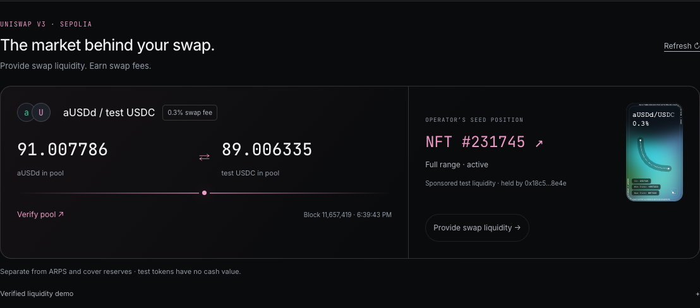

| | Fund cover | Provide swap liquidity |
| --- | --- | --- |
| Network | Hedera testnet | Ethereum Sepolia |
| Receipt | Fungible **ARPS** shares | **Uniswap V3 position NFT** |
| Capital supports | Conditional earthquake payouts | aUSDd ↔ test USDC trades |
| Income / exit today | Not implemented for ARPS | Actual swap-fee collection and partial/full withdrawal |

**Try: Swap → Provide swap liquidity → Start with test tokens.** Add 0.01–1
bridged aUSDd plus matching test USDC. Review amounts and confirm; exact approvals and the mint are handled together. Its balances, uncollected tokens and receipt
appear together. Select **Collect fees** or **Remove** to return tokens to your wallet.

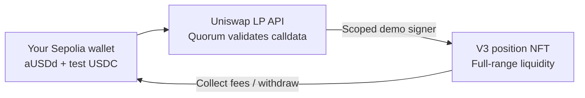

The page reads the pool and position from Sepolia; the seed NFT artwork comes
from Uniswap's on-chain `tokenURI`. **Operator seed** and **Your position** are
separately labeled. Pool fee is **0.3% per swap**, not an APY. Uncollected amounts
are read with `eth_call`; they include any principal previously removed without
collection. All tokens have no cash value, and token proportions can change.

**Confirmed lifecycle:** NFT **#231762** was created and increased; a separate
swap generated fees; **0.000006 aUSDd** was collected; 50% and then the remaining
liquidity were withdrawn. Seed NFT #231745 retained its original liquidity.
[Mint](https://sepolia.etherscan.io/tx/0x156128aef98952488fdd34174fa300bfe35be0a50cdb68fad31aa4927283989c) ·
[Collect](https://sepolia.etherscan.io/tx/0xb190fc08ba9686ef4ac0a4b9f4e0b3009ab7dc2820eeeb5c9063f6b9c6d04634) ·
[Exit](https://sepolia.etherscan.io/tx/0x59e266a5f575f9cde213337cf38cfa39fbc177ec40e963729974a48eb996fbd8) ·
[All receipts](docs/evidence/uniswap-liquidity.json).

[API adapter and validation](src/settlement/liquidity.js) ·
[Wallet interface](ui/src/app/SwapLiquidity.tsx) ·
[Guardrail tests](tests/liquidity.test.js) ·
[LP API reference](https://developers.uniswap.org/docs/liquidity/liquidity-provisioning-api/integration-guide).

**Guardrails:** fixed chains/contracts/assets; exact input and recipient; 0.5%
slippage; validated router commands and permit schema; short-lived quotes;
wallet gas checks; bounded API calls; persisted pending transactions and
same-request reconciliation. An uncertain transfer is never automatically repeated.

[Bridge](src/settlement/bridge.js) · [Trading API adapter](src/settlement/bridgedSwap.js)
· [Wallet UI](ui/src/app/DemoEvm.tsx) · [Security](docs/AGENT-SECURITY.md)

## What is new

The contribution is the integration of **hazard pricing → fixed obligation →
policy-bound oracle signatures → native scheduled execution**, with evidence a
judge can inspect at each step. It is not a claim to invent parametric insurance,
NFT receipts or multisignatures.

| Built during this event | Improvement contributed |
| --- | --- |
| **Reusable signature-gated settlement plugin** | Extracts the fixed-transfer primitive from the demo into Hedera Agent Kit tooling. |
| **Hazard-priced issuance with durable guards** | Turns a map location into explicit terms while checking budgets, capacity and retry safety before ledger writes. |
| **Policy-bound, x402-paid oracle services** | Connects paid catalogue access with constrained signing; payment itself never authorizes a claim. |
| **Verifiable, geographic cover UX** | Makes location, payout, funding risk and chain evidence understandable through maps, receipts and signature diagrams. |

The Uniswap and Axelar plugins predate this event; their guarded quote, bridge
and swap integration here is new. Earlier Aivy work also used HTS pools and scheduling. The detailed
[continuity disclosure](#prior-work-boundary-continuity-track) identifies reuse,
event work and the Agent Kit contribution. [AI assistance is disclosed](docs/AI-ASSISTANCE.md).

## Verify in one minute

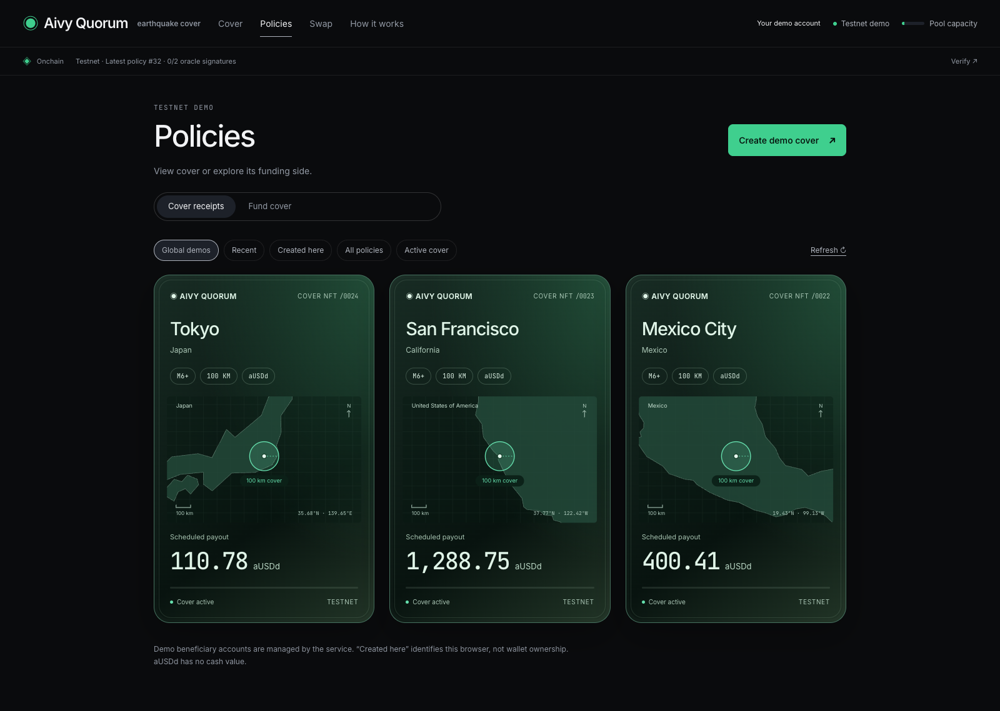

*Global demo cover receipts. Open a card for its scheduled payout, HCS terms and
transfers, with links to HashScan.*

| Judge action | Evidence / scope |
| --- | --- |
| Open **How it works → Release** | Recorded **4 HBAR mainnet** transfer, with receipt. Controlled signatures, not a real earthquake claim. |
| Open a policy → **Agent guardrails & proof** | Runtime limits plus separate mainnet controls: [1 HBAR transferred](https://hashscan.io/mainnet/schedule/0.0.10843723), [5 HBAR blocked](https://hashscan.io/mainnet/schedule/0.0.10843725) without the agent signature. |
| Open **Swap → Bridge / Swap** | Real Hedera → Axelar → Sepolia → Uniswap test-token flow. [Receipts](docs/evidence/cross-chain-testnet.json). Mainnet prices are a separate preview. |
| Open **Swap → Provide swap liquidity** | Actual pool, seed NFT art, wallet positions, exact approvals, add/collect/withdraw. [Verified lifecycle](docs/evidence/uniswap-liquidity.json). Separate from ARPS. |
| Open **Onchain / Verify** | Testnet NFT, transfers and paid oracle evidence. [Blocky402 integration](docs/BLOCKY402.md); hosted testnet facilitator. |
| Open **Funding estimate** | Proposed per-policy contribution, premium share and capital-at-risk outcomes. No deposit or LP NFT is issued; actual LP primitives use shared-pool fungible shares. |

## Security by architecture

**The deployed agent is deterministic: no LLM decides or signs a public policy.**
A future planner must stay outside the signing boundary. Security is enforced in
code and ledger keys, not by a system prompt.

```mermaid
flowchart LR
  Input["🌐 Untrusted<br/>input"] --> Validate["✅ Typed<br/>allowlist"]
  Validate --> Budget["⏱️ Durable budgets<br/>and issuance lock"]
  Budget --> Reserve["🏦 Balance check<br/>and reservation"]
  Reserve --> Sign["✍️ Exact transaction<br/>authority"]
  Sign --> Gate["🔐 Ledger<br/>signature gate"]

  classDef record fill:#1c2333,stroke:#64748b,stroke-width:1.5px,color:#e2e8f0
  classDef commit fill:#0d3b2e,stroke:#34d399,stroke-width:2px,color:#a7f3d0
  classDef oracle fill:#3a2c08,stroke:#f5b301,stroke-width:2px,color:#fde68a
  classDef ledger fill:#0b2f40,stroke:#38bdf8,stroke-width:2px,color:#bae6fd
  classDef result fill:#064e3b,stroke:#10b981,stroke-width:3px,color:#d1fae5
  classDef outside fill:#2b1830,stroke:#c084fc,stroke-width:1.5px,color:#f3e8ff
  class Input outside
  class Validate,Budget,Reserve commit
  class Sign ledger
  class Gate result
```

> Every layer narrows what the next one may do. By the last, the only thing the
> agent can authorize is the exact transfer already written in the terms.

| Before a signature | Protection |
| --- | --- |
| Public request | Testnet-only issuance, bounded JSON and fields; no caller-selected beneficiary or raw transaction. |
| Spending admission | Default **3 attempts/IP/hour · 100 attempts/24h · $20k modeled cover/24h**; survives restart. |
| Interrupted issuance | Idempotent request IDs, retained reservations, kernel locking and reconciliation. |
| Oracle / x402 / Uniswap | Exact terms/transfer verification; explicitly bounded payments; mainnet quote-only authority; bounded Sepolia preparation and isolated demo signing. |
| Runtime | Private key/config files, loopback services behind TLS, patched minimal dependencies. |

**Hosted x402:** [Blocky402 payment flow, code and guardrails](docs/BLOCKY402.md).
The three oracle services use its Hedera testnet verify/settle API; no local
facilitator fallback or mainnet funds are needed.

**Latest hardening:** [crash recovery, x402 ordering and interleaved terms](docs/qa/SECURITY-FINAL.md).
The September 6 baseline had 41 offline tests; the current review covers the expanded suite. A [live refusal check](docs/evidence/agent-guardrails.json)
confirmed an oversized request caused no ledger write. [Current runtime limits](https://quorum.aivylabs.xyz/api/guardrails).

<details>
<summary>All guardrails, implementation links and verification details</summary>

| Protection | Implemented behavior | Source / evidence |
| --- | --- | --- |
| Restricted public authority | Public issuance is testnet-only. Exact input fields, typed coordinates, $1–$50 modeled budget, 7–62 day duration and an 8 KB JSON object limit. A visitor cannot supply a beneficiary, key or arbitrary transaction to issuance. | [HTTP validation](src/http-safety.js), [API routes](src/server.js) |
| Durable spending admission | Default limits: **3 attempts/IP/hour, 100 attempts/rolling 24h, $20,000 modeled cover/rolling 24h**. Consumed before ledger actions; failed or uncertain admitted attempts remain charged. Configuration is validated. Atomic private journal survives restarts; invalid journal pauses writes. | [Budget guard](src/guards.js), [deployed refusal evidence](docs/evidence/agent-guardrails.json) |
| Trustworthy request identity | Forwarding headers are trusted only from a configured loopback proxy, using the final proxy-appended address. Budget records use HMAC-derived IP identifiers; public errors omit internal exception details. | [HTTP safety](src/http-safety.js), [guardrail tests](tests/guardrails.test.js) |
| Capacity and replay protection | Exclusive issuance lock, fresh pool balance and durable reservation before ledger writes. Reusing a request ID does not mint again. Interrupted writes retain reservations and receipt checkpoints. A permanent kernel lock serializes recovery across processes; dead-owner markers are reclaimed inside it, while malformed markers refuse work. | [Issuance](src/policy/issue.js), [book](src/book.js), [lock](src/issuance-lock.js), [safety tests](tests/safety.test.js) |
| Policy-bound oracle authority | Verifies configured HCS topic, issuer signature, canonical terms hash, time window, network, asset, beneficiary and exact scheduled amount. Reassembles matching HCS chunks on both sides of their pointer, including interleaved messages. Rejects extra transfer legs, allowances and unsupported fields. Caller input cannot lower the published trigger; queries are bounded, missing data is not a positive vote, duplicate identities do not become a quorum. | [Policy binding](src/policy/binding.js), [oracle implementation](src/oracle/), [security review](docs/AGENT-SECURITY.md) |
| Ledger-enforced signature gate | The pool requires **agent AND 2-of-3 oracle keys**. Oracle keys alone cannot spend. Signature evidence and observed execution are displayed separately. | [1 HBAR executed control](https://hashscan.io/mainnet/schedule/0.0.10843723), [5 HBAR blocked control](https://hashscan.io/mainnet/schedule/0.0.10843725) |
| Bounded x402 payment authority | Client checks explicitly authorized resource, network, recipient, asset, fee payer and maximum amount before signing; paid redirects and automatic new payments after uncertain responses are refused. The service checks exact payment bodies and payer signatures before querying, charges through Blocky402 only if it can answer, and serves/signs after its matching consensus receipt. A persistent attempt journal prevents replay across processes and restarts. Extra debits/approvals and excessive fees are refused. | [Payment policy](src/x402/payment-policy.js), [facilitator](src/x402/facilitator.js), [payment tests](tests/payments.test.js) |
| Uniswap least privilege | Mainnet is quote-only. Sepolia execution pins the router, chain, token path, recipient, amount, minimum output and allowed commands. API key stays server-side. The isolated demo signer executes only validated Sepolia operations. | [Conversion tests](tests/cross-asset.test.js), [live quote evidence](docs/evidence/uniswap-quotes.json) |
| Runtime and secret isolation | Project listeners bind to loopback behind TLS nginx; environment/registry files use 0600 and artifact directory 0700. Project-specific Node 22 runtime and patched protobuf, WebSocket and gRPC dependencies. Minimal runtime installation omits unrelated automatic peers. | [Operational review and install instructions](docs/AGENT-SECURITY.md#operational-review), [lockfile](package-lock.json) |
| Visible verification | Open a policy → **Agent guardrails & proof** for current limits/usage and recorded authorization controls. Read-only endpoint exposes configuration without keys or IP identifiers. | [Live guardrails](https://quorum.aivylabs.xyz/api/guardrails), [UI implementation](ui/src/app/AgentGuardrails.tsx) |

**Verification recorded September 6, 2026:** 41 offline tests passed locally and
in the isolated VPS runtime, including malformed requests, forged IP headers,
quota persistence/corruption, concurrent issuance, payment substitution, uncertain
payment retry, term binding and duplicate votes. The UI production build passed.
The documented minimal production dependency tree reported zero known advisory
vulnerabilities at that check; this is not proof of vulnerability-free software.

The [deployed guardrail snapshot](docs/evidence/agent-guardrails.json) records an
oversized request refused before reservation or ledger work, with no request
record and unchanged budget. Snapshot usage is historical; the live endpoint
shows current usage. The security review did not create a policy or send a payment.

</details>

### Trust boundary

This is a prototype with hot keys under one VPS/administrative trust domain.
Separate keys and catalogue sources do not mean independent oracle operators.
Agent plus oracle quorum can authorize spending; the ledger key does not encode
all underwriting rules. Capital reservations are off-ledger and assume one
shared authoritative book and lock. External spending can invalidate capacity.

Real customer value requires independent key administration, managed/HSM signing
with transaction policies, authenticated customer/funding actions, perimeter
limits and alerting, recovery/backups, and transactional storage before scaling
across hosts. The hosted x402 facilitator controls fee sponsorship; the app does not claim a production abuse budget
or automatic refund system. **No independent security audit or production
readiness is claimed.** See the [full threat boundaries](docs/AGENT-SECURITY.md)
for the architecture rationale and remaining work.

## Try real transactions without connecting a wallet

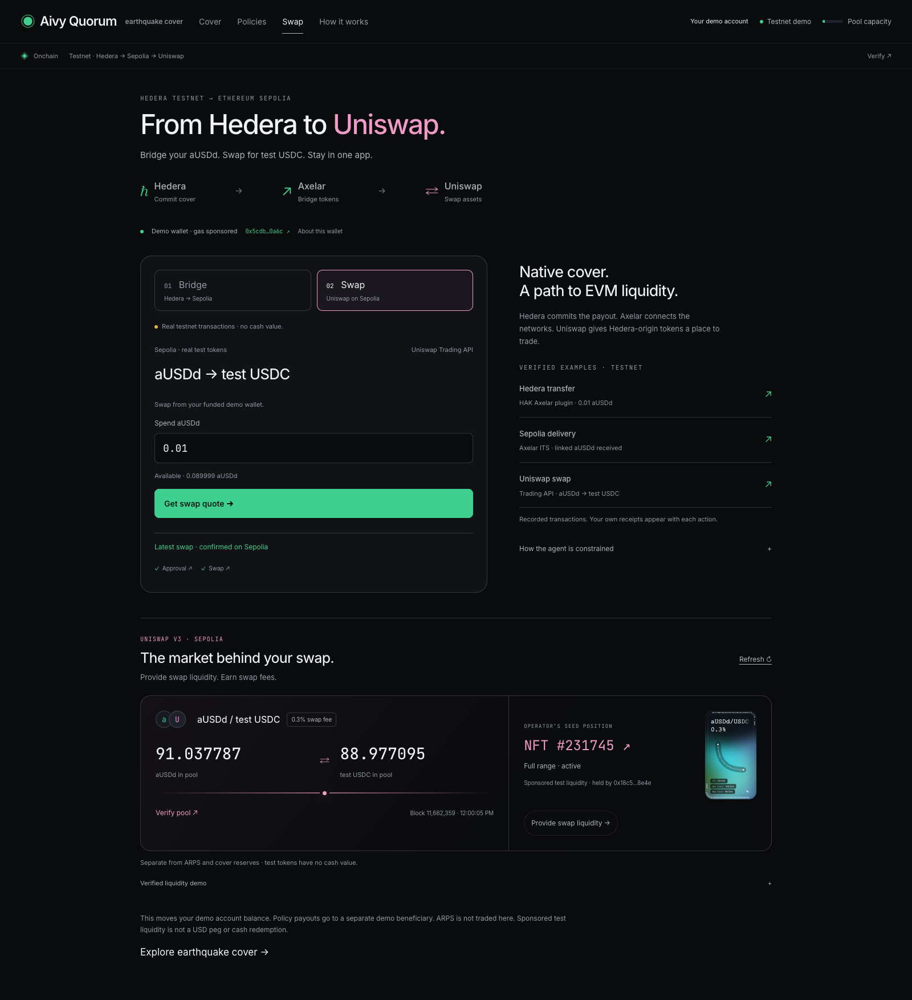

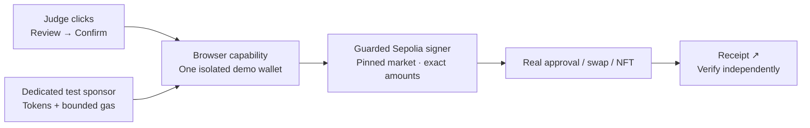

| Friction removed | Protection retained |
| --- | --- |
| No extension, connection prompt or faucet | Service-managed custody is labeled; keys never leave the server |
| Starter tokens and sponsored gas | Separate sponsor, per-session/daily budgets, gas reserve for LP exit |
| Approvals handled with the action | Exact allowances, fixed chain/contracts and verified NFT owner |
| Refresh or interrupted connection | Signed bytes and hash saved before broadcast; original request reconciles |

Mainnet signing, arbitrary transfers and ARPS withdrawals are outside this signer.
[Implementation and limits](docs/MANAGED-DEMO-WALLETS.md) ·
[Security tests](tests/evm-demo.test.js) · [Real swap, mint and exit receipts](docs/evidence/managed-wallet-demo.json).

## Design: understand first, inspect deeper

<table>
<tr>
<td width="50%">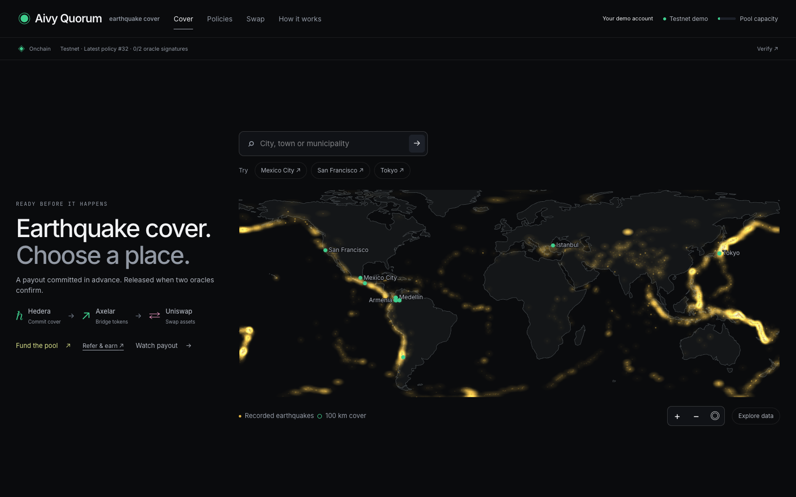</td>
<td width="50%">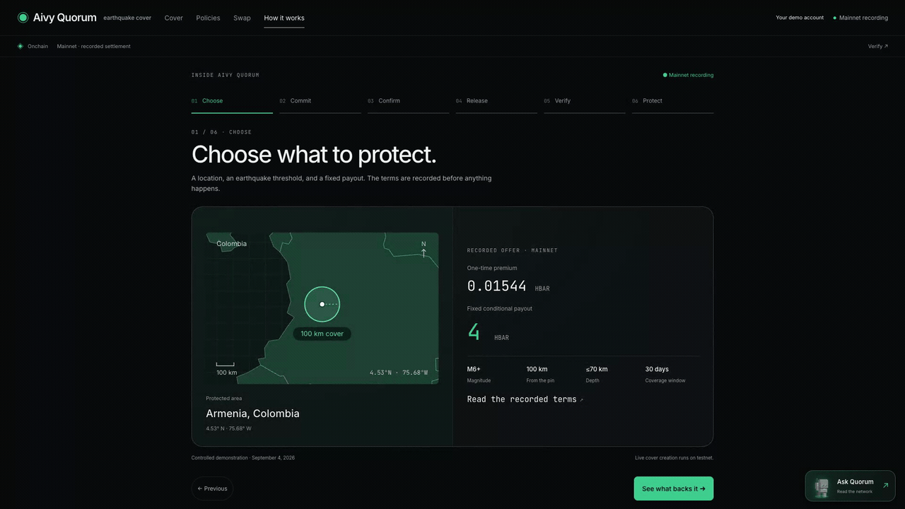</td>
</tr>
<tr>
<td><b>The atlas.</b> Nothing here is drawn. The fault lines emerge from plotting
6,311 real shallow M6+ events, so the map is the evidence rather than a picture of it.</td>
<td><b>How it works.</b> Six scenes over one real mainnet settlement — choose,
commit, confirm, release, verify, protect — labelled as a recording, not live.</td>
</tr>
</table>

**Cover → Policies → Swap → How it works.** Four destinations. Network roles are
visible on arrival; technical evidence stays one disclosure away.

| Visual | What it teaches |
| --- | --- |
| **World map + geographic NFTs** | Where cover applies; worldwide search and Mexico/California/Tokyo demos. |
| **Interactive premium history** | Beside the map, below the location estimate: a fixed **$800 modeled payout**, interactive year selection and red/green annual change. [View the layout](docs/media/08-explore-history.png). |
| **LP contribution + two outcomes** | Premium share and principal at risk, explicitly labeled as a preview. |
| **Hedera → Axelar → Uniswap** | Native cover, cross-chain transport and EVM liquidity have distinct roles. Two action steps sit beside labeled testnet examples. |
| **Signatures → transfer → receipt** | Who signed, why execution happened or was blocked, and where to verify it. |
| **Responsive disclosures** | Minimal main copy, mobile stacking, keyboard focus and reduced motion; 320px through desktop reviewed. |

<details>
<summary>All design improvements and browser verification</summary>

| Improvement | What the visitor sees / why it matters |
| --- | --- |
| Global discovery | City labels resize for phones, avoid overlaps and zoom controls, and give the selected location priority. Debounced Photon/OpenStreetMap city and municipality search, keyboard selection, coordinate entry, map pinning, zoom/pan, and Mexico, California and Tokyo demos. Unaccented “Medellin” was verified. Search coverage depends on the upstream catalogue. |
| Geographic NFT identity | Aivy Quorum branding, local map, approximate 100 km protected area, terms, payout and network replace abstract artwork. Cover NFTs and proposed LP receipts remain visually distinct. |
| Understandable pricing history | A full-width **Explore data +** row aligns with the other options in the right-hand panel and opens the chart directly under the selected location’s estimate. On phones/tablets, it stacks below the map and opens at the location details. The premium-over-time chart holds the modeled payout at **$800**, with the selected year and red/green annual variation. Click, tap or drag the chart—or use the keyboard/timeline—to choose a year. Historical exploration cannot change issued terms; returning to Cover restores the current M6+ quote. |
| Visual funding preview | Contribution slider, premium share and two claim outcomes show how capital might participate. Annual premium rate is gross, before claims/costs; contributed principal can be used for a payout. One model/limitations disclosure holds the assumptions; claim/no-claim bars align even when labels wrap. Preview/unminted labels remain visible. |
| A clearer six-scene story | Geographic terms → capital commitment → named signatures → transfer animation → NFT/receipts → blocked authorization control. Direct step links and previous/next controls keep the recorded mainnet demonstration navigable. Mobile shows debit and credit side by side. |
| Explicit signature evidence | Old circular diagrams were replaced with **agent key AND oracle threshold → observed result**. “3 signed · 2 required” avoids ambiguous counts. Missing agent signature explains the blocked control; unknown ledger status remains unverified. |
| Quiet blockchain visibility | Optional Onchain/Verify panel and contextual receipt links expose NFT mint/delivery, transfers, agent/oracle actions and x402 evidence. Testnet, recorded mainnet, live API quotes and proposed funding are labeled separately. Three compact catalogue results expand into full verdicts, x402 payments and signatures. Unknown or invalid policies do not borrow another policy's receipts. |
| Discoverable Uniswap execution | A main-nav Swap page separates Bridge and Swap, preserves in-progress form state between steps and shows example receipts beside the actions. Quote/policy links lead here directly. Mainnet price previews remain separate, collapsed and fetched only on demand. Expiring reviews and labeled latest receipts keep preparation distinct from completed transactions. |
| Funding decisions | Existing holders see ARPS and percentage of issued shares before pool totals; the deposit action states that withdrawals and LP income are unavailable. The percentage is a holding share, never an APY. The account’s Pool shares link goes directly to this position. |
| Recovery and navigation | Saved request IDs, interrupted-request review, honest loading/refusal/offline states and retry links. Budget/duration precede purchase; expired swap/LP reviews request a refresh. Popups close without discarding the quote behind them. Location persists on refresh, gallery filters survive detail round trips, invalid routes offer recovery, and “Created here” means this browser—not wallet ownership. |
| Responsive and accessible controls | Mobile policy views lead with the location and status; layouts stack and story navigation remains accessible; maps/charts have text descriptions, controls support keyboard use, focus is visible for keyboard interaction, and reduced-motion preferences are respected. Recent reviews covered 320 px mobile through desktop without horizontal overflow in the checked flows. |

The [implementation audit](AUDIT-IMPLEMENTATION.md) records the delivered changes
and checks; the [current readiness review](docs/qa/READINESS-REVIEW.md) covers
Cover, Policies, NFT/LP, historical chart, story and the direct Swap journey. The
[September 6 review](docs/FINAL-UX-REVIEW.md) preserves the earlier recording baseline. Legacy ring components in
unrouted source files are not used by the active app. These are documented
browser checks, not a claim of exhaustive device or accessibility certification.
The [history sidebar review](docs/qa/EXPLORE-SIDEBAR.md) covers responsive placement,
playback, pointer/touch/keyboard selection and returning to the current quote.

</details>

## Run locally

Use Node 22 or newer.

```sh
npm ci
# Configure .env from .env.example. Provisioning spends testnet assets:
npm run provision
npm run serve
# In another terminal:
cd ui
npm ci
npm run dev
```

Open http://localhost:5173. Vite proxies `/api` to the local API on port 8791.
The API binds to localhost by default and refuses public mainnet issuance.
For hosting, serve the UI with an SPA fallback and proxy `/api` to the backend,
or build with `VITE_AGENT_URL` pointing to its HTTPS origin. Set `HOST` for the
intended interface and `TRUST_PROXY=1` only behind a trusted reverse proxy.

<details>
<summary>Pricing, recovery and reproduction checks</summary>

## Pricing and capacity

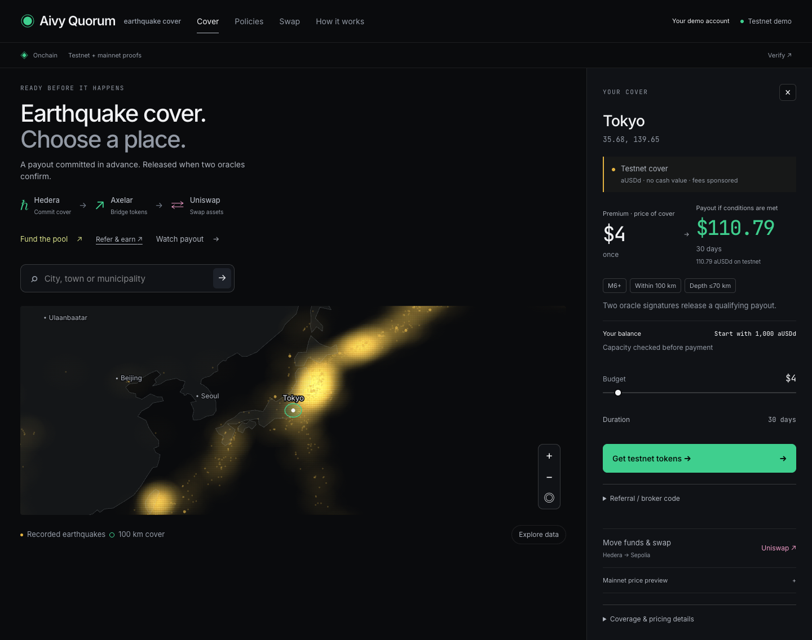

*Armenia, Quindío: the panel pairs the modeled premium with its conditional
30-day payout and testnet token amount. Pricing comes from the USGS catalogue
for that point; inspect the source under "Coverage & pricing details".*

A first-order Poisson model estimates shallow M6+ frequency over a 300 km
reference region, scales to the fixed 100 km trigger circle, and adds uncertainty
loading. It is reproducible, not actuarial-grade. A location without qualifying
historical data is declined; no record does not establish zero risk.

The payout requires M6+, distance ≤100 km, depth ≤70 km, and an event inside the
coverage window. Damage alone does not qualify. Terms last 7–62 days; late event
reporting or missing oracle service can prevent timely signatures.

The local issuance book reserves aggregate promised payouts before ledger writes,
under an exclusive filesystem lock. Issuance is refused when existing promises
plus the request exceed available capital. These are off-ledger reservations:
funds are not individually escrowed per schedule, and external spending can
invalidate capacity. Multiple instances must share the same book and lock;
independent disks are unsupported. Issuance admission limits are persisted in the
shared private journal; restarting the process does not reset them.

## Interrupted requests

The browser saves a random request identifier before creation. Policies checks
`GET /api/requests/:id`; completed requests resolve to the issued policy and
interrupted requests remain visible for review. Replaying an identifier never
creates another policy. Issuance checkpoints retain public ledger identifiers.

A failed issuance retains its capital reservation. All writers hold an OS `flock`
on a permanent `.artifacts/issuance-<scope>.lock.guard` file for the entire operation.
The OS releases that lock on process death. The next holder can safely remove a
valid `.lock` owner marker only when its process is provably gone. Live owners,
malformed markers and uncertain ownership refuse work. **Never delete a `.guard`
file while writers can run.**

Recovering a lock does not replay a transaction or release its reserved capital.
An operator must inspect HCS, NFT, premium, schedule or EVM receipt checkpoints
and reconcile the original request. Never blindly delete reservations or signed
transaction journals. See the [upgrade and recovery procedure](docs/AGENT-SECURITY.md#kernel-locking-and-recovery).

## Verification

```sh
npm test                 # offline pricing, authorization, payment and issuance tests
npm --prefix ui run build
```

The reusable plugin has its own tests in the sibling repository:

```sh
cd ../hak-scheduled-settlement
npm test
npm run typecheck
npm run build
```

`d1`, `d2`, `d3`, and `verify-quorum.js` are controlled HBAR ledger demonstrations,
not offline tests. They spend network assets and update `.artifacts` and
`LINKS.md`. They are separate from the current app's token issuance flow; d3
submits controlled signatures rather than verifying a real earthquake. Run in an
isolated checkout with separate demo accounts if reproducing the historical run.
The UI's frozen mainnet record is not replaced automatically.

</details>

Latest [QA and judge review](docs/qa/JUDGE-REVIEW.md): 111 passing tests, reproducible installs, payer-signature preflight, reliable API errors, responsive flows and fresh testnet receipts.

## Prior work boundary (CONTINUITY track)

Earlier Aivy infrastructure and the **Uniswap and Axelar HAK plugins** are reused;
the conditional settlement plugin, earthquake application and guarded cross-chain
integration are event work.

<details>
<summary>Full prior-work disclosure and upstream contribution</summary>

**This repository's commit history starts on September 4, 2026.** Pre-existing
projects and packages reused here are disclosed below; they are not claimed as
new event work.

What existed before the event, and does **not** count as new work:

- **[aivy-studio](https://github.com/jmgomezl/aivy-studio)** — the multi-agent
  orchestration canvas this project is built to run on. Existing HCS-10 transport,
  HTS escrow, workflow schema, canvas rendering.
- **[jmgomezl/aivy](https://github.com/jmgomezl/aivy)** — earlier APEX-hackathon app.
- **hak-saucerswap-plugin, hak-pyth-plugin** — endorsed third-party plugins in the
  Hedera Agent Kit docs.
- **hak-uniswap-plugin** — Uniswap Trading API plugin with allowance handling and a
  Ledger threshold gate, proven on Sepolia. Reused here for live USDC-to-ETH
  conversion quotes on Base and Unichain. The mainnet quote UI does not execute
  swaps; the Sepolia execution adapters are project-specific integration work.
- **[hak-axelar-plugin](https://github.com/jmgomezl/hak-axelar-plugin)** — Juanma
  Gomez's pre-existing cross-chain plugin for Hedera Agent Kit, reused at **1.0.1**.
  Its **`axelar_send_token`** builder prepares the Hedera ITS transfer to Sepolia.
  The plugin itself is prior work; Quorum's guarded adapter and verified delivery
  flow were built during this event. [Integration and receipts](#built-with-our-hak-axelar-plugin).
- **Aivy Settlement Layer (ETHGlobal Lisbon, July 2026)** — a prior continuity
  build on aivy-studio that also used HTS pools and Scheduled Transactions. The
  overlap is the *substrate*; what is new here is stated below.

What is **new**, built during this event:

1. **Signature-gated conditional settlement** — payout as a pre-signed Scheduled
   Transaction whose trigger is oracle-quorum signature accumulation, with the
   nested `and(agent, k-of-n)` key that enforces the signature restriction. Extracted as
   [hak-scheduled-settlement](https://github.com/jmgomezl/hak-scheduled-settlement),
   a Hedera Agent Kit plugin this repo consumes, rather than left inside the app.
   Building it surfaced a gap in the kit itself — account creation cannot express
   a multi-signature key — filed as
   [hedera-agent-kit-js#1087](https://github.com/hashgraph/hedera-agent-kit-js/issues/1087)
   and fixed in the open PR
   [#1088](https://github.com/hashgraph/hedera-agent-kit-js/pull/1088).
2. **A hazard-priced underwriting agent** — premiums derived live from the USGS
   catalogue for any lat/lon on earth, with published inputs.
3. **An issuance capacity guard** reserving aggregate exposure against available capital in the shared book. External spending can invalidate this off-ledger reservation.
4. **Atomic premium settlement with an open broker channel** — buyer, pool and an
   arbitrary per-sale broker settled in one multi-party transaction.
5. **Blocky402-paid oracle services** — the oracle agents sell policy-bound
   evidence through hosted testnet x402; the Quorum agent consumes the services.
6. **Guarded Hedera → Axelar → Uniswap integration** — validates plugin-built
   transfers before signing, corrects native Hedera ITS gas units, journals the
   transaction before broadcast and matches source/destination events. This
   connects the existing plugins to Quorum's funded demo wallets and real Sepolia
   swaps. [Adapter](src/settlement/axelarPlugin.js) ·
   [Tests](tests/axelar-plugin.test.js) · [Delivery evidence](docs/evidence/hak-axelar-plugin.json).

</details>

<details>
<summary>Repository map</summary>

## Layout

- `src/policy/`: pricing-to-issuance flow, HCS terms, NFT and scheduled transfer.
- `src/oracle/`: catalogue adapters, event checks and policy-bound signing.
- `src/x402/`: exact payment verification, settlement and client.
- `src/book.js`, `src/issuance-lock.js`: durable reservations and serialization.
- `src/guards.js`, `src/http-safety.js`: durable admission budgets and public input validation.
- `docs/AGENT-SECURITY.md`, `docs/evidence/`: trust boundaries and verifiable snapshots.
- `src/ledger.js`: shared policy status from actual signer identities.
- `ui/`: map, quotes, policies and recorded demonstration.
- `deploy/`: oracle deployment configuration.
- `research/`: model rationale and historical integration notes.
- `LINKS.md`: historical ledger artifacts.


</details>

MIT.

### Current recording capacity

The hosted demo uses **12 attempts/IP/hour, 100 attempts/24h and 100,000 modeled
cover/24h**, overriding conservative defaults. The pool was topped up to
**200,000 testnet aUSDd**; these tokens have no cash value. Existing reservations
and usage remain intact. [Verified capacity and top-up receipt](docs/evidence/demo-capacity.json)
· [Current limits](https://quorum.aivylabs.xyz/api/guardrails).
