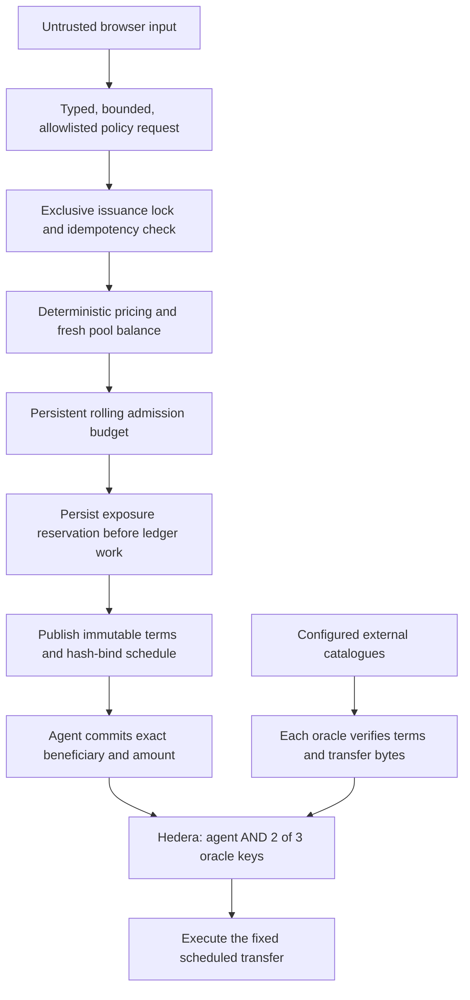

# Agent guardrails and trust boundaries

The deployed agent is a deterministic underwriting and transaction workflow.
There is no LLM in the public quote/issuance/signing path. Location labels are
untrusted display data, not instructions. A future AI planner must remain outside
the authorization boundary and call this constrained policy service; it must not
receive raw private keys, a shell, or a generic transaction-signing tool.

## What a judge can verify

| Boundary | Enforcement / evidence |
| --- | --- |
| Public requests cannot choose arbitrary operations | `src/http-safety.js`: exact field allowlist, numeric coordinates, budget $1–$50, integer duration 7–62 days, bounded request ID, 8 KB JSON object limit. No beneficiary, raw transaction, signing key or schedule ID accepted by issuance. |
| Mainnet is not a public faucet | `src/server.js` and `src/guards.js` reject public creation outside testnet. There is no environment opt-in that enables the public mainnet route. CLI mainnet demos are a separate operator action. |
| Budget control happens outside any model | `src/guards.js`: limits validated at startup; attempt/IP/hour, attempt/24h and modeled cover/24h limits are consumed before the first ledger action. Interrupted attempts remain charged. |
| Restart does not reset limits | Private atomic JSON journal under `.artifacts/write-budget-testnet.json`. First migration seeds known policies/reservations. Missing historical IP attribution cannot be reconstructed; the global budget is restored. Invalid journal pauses writes. |
| Quotas cannot be bypassed with a forged IP prefix | Loopback proxy is explicitly trusted; only the final proxy-appended address is used. External peers' forwarding headers are ignored. Nginx appends the actual client address. |
| Pool capacity is not double-promised | `src/issuance-lock.js`, `src/policy/issue.js`, `src/book.js`: cross-process lock, fresh SDK balance check and persistent reservation before account creation. An abandoned lock fails closed. |
| Retries do not mint a second policy | Existing request ID returns its original completed policy or a needs-review response. Partial progress is persisted; uncertain reservations are not silently released. |
| The schedule is bound to policy terms | `src/policy/binding.js` hashes canonical terms; oracle verifier checks the configured HCS topic, issuer signature, time window, exact asset, amount and beneficiary, rejects extra legs/allowances/unknown fields. |
| Oracle input cannot lower the insured trigger | `/attest-and-sign` derives its spec from published terms, not caller-provided conditions. Catalogue queries are bounded; missing data is not a positive vote. |
| One catalogue is not a quorum | Distinct signing identities are counted. The helper quorum also deduplicates catalogue names. The live services use USGS, EMSC and GEOFON. |
| Network authorization is separate from app checks | The pool key is `agent AND threshold(2, oracle keys)`. Recorded mainnet control and blocked schedules are linked from “Agent guardrails & proof”. Those prove the key restriction, not independent operators. |
| An HTTP 402 cannot freely spend a caller's money | `src/x402/payment-policy.js`: an explicit resource, network, recipient, token, fee payer and maximum amount must match before signing. Paid redirects are refused. An uncertain response never causes an automatic new payment. |
| The facilitator signs only the required payment | `src/x402/facilitator.js` decodes every node body and rejects extra debits, unrelated assets, allowances and excessive fee caps. Consensus receipt, not precheck, determines success. |
| Mainnet Uniswap quotes do not have spending authority | Server selects only the quote tool; USDC→ETH on Base/Unichain is allowlisted and bounded. No EVM key is required, no approval or broadcast occurs. API key stays server-side. |
| Judges can inspect deployed configuration | `GET /api/guardrails` exposes network, execution mode, limits and current usage, without IP identifiers or secrets. UI labels this as runtime configuration, not a security certification. |

## Operational review

The deployed Node listeners for this project are loopback-only behind TLS nginx.
The environment and registry files checked on the VPS are mode 0600, and the
artifact directory is mode 0700. Registry writes now preserve private permissions.
The API no longer reflects arbitrary internal exception text to visitors.

This deployment still uses hot keys and a shared VPS/administrative trust domain.
A process separation or different public keys does **not** protect against a
compromised host or administrator who can read all key files. Agent plus oracle
quorum can authorize transfers beyond the app's intended workflow; the Hedera
account key does not itself encode all underwriting restrictions. Reservations
also assume all underwriting writers use the same lock and authoritative book.

Before handling real customer value: isolate oracle operators and credentials;
use managed signer/HSM custody with transaction-policy enforcement; authenticate
funding/customer actions; separate fee-payer budgets; add perimeter request limits,
alerting, backups and an audited recovery runbook; use a transactional database
and distributed locking if scaling across hosts. An offline root of trust and
independent key administration matter more than a stronger system prompt.

The facilitator still relies on ledger signature verification and receipts, and
has no production fee-sponsorship abuse budget. Paid service failures need receipt
reconciliation; there is no automatic refund system. No production readiness or
independent security certification is claimed.

## Reproduce checks

- `npm test`: adversarial tests for quota persistence, corrupt journals, forged
  IP headers, malformed bodies, unauthorized fields, payment-policy substitutions,
  ambiguous payment retry, oracle term binding, duplicate votes and concurrent
  issuance. Tests use temporary directories and local fake transactions; no
  test runner broadcasts to Hedera.
- `npm --prefix ui run build`: frontend typecheck and production build.
- `npm audit --omit=dev --omit=peer`: audit the documented minimal runtime install.
- `GET /api/guardrails`: read runtime configuration without triggering a write.
- Open a policy → **Agent guardrails & proof** → technical source and mainnet
  control/blocked schedule links.

Runtime installation explicitly includes the scheduled plugin's required modern
Agent Kit package and omits unrelated automatic peer installations. Use
`npm ci --omit=dev --omit=peer` for deployment, then run the tests and import smoke
checks before switching the live dependency directory. Do not use `--force` to
silence dependency incompatibilities.

## Design basis

OWASP recommends enforcing authorization downstream of a model, minimizing tool
permissions and limiting excessive agency. This app applies that boundary in code
and ledger keys rather than natural-language instructions:
[OWASP Excessive Agency](https://genai.owasp.org/llmrisk/llm062025-excessive-agency/),
[OWASP Prompt Injection](https://genai.owasp.org/llmrisk/llm01-prompt-injection/).
The network-signature behavior is described in
[Hedera scheduled transactions](https://docs.hedera.com/hedera/core-concepts/scheduled-transaction).

### Deployed runtime

Use Node 22 or newer. The VPS uses a project-specific Node 22.23.2 installation
under `/opt/quorum-runtime`; its archive was checked against Node.js's official
HTTPS SHA-256 manifest. Only Quorum's four PM2 processes select this interpreter.
Other applications and the system Node installation remain untouched.

The lockfile pins patched protobuf 7/8, WebSocket 8 and gRPC 1.x versions.
The production dependency tree is installed with `--omit=dev --omit=peer` after
explicitly declaring the modern Agent Kit needed by the settlement plugin. The
older unused automatically installed Agent Kit peer is omitted. Audit the actual
installed tree on every deployment; a clean advisory scan is not proof that the
application has no vulnerabilities.

### Demo capacity configuration — September 6, 2026

The public VPS overrides the conservative code defaults with 12 attempts per IP
per hour, 100 admitted attempts per rolling 24 hours, and 100,000 modeled USD of
cover per rolling 24 hours. Existing usage was retained, not reset. The operator
replenished the unbacked testnet pool to 200,000 aUSDd from the demo treasury;
this is a treasury top-up, not an LP deposit or share issuance. The actual-capital
check remains mandatory. These settings do not allow public mainnet writes.

[Capacity and transaction evidence](evidence/demo-capacity.json).
`scripts/replenish-demo.js` is operator-only, refuses other networks/assets and
dry-runs by default. `--execute` tops up to its fixed target and journals the
submitted transaction ID before waiting for consensus. Reconcile an uncertain
submission before running it again. It is not exposed as a public faucet.

### Interactive accounts and broker flow — September 7, 2026

Public cover creation now requires a browser-held 256-bit demo capability.
The server stores only its digest and resolves custodial signing keys privately.
Referral codes resolve only ready registered accounts; self-referrals and arbitrary
broker account fields are refused. Starter grants and deposit/purchase actions
have separate durable quotas and use the same global issuance lock.
Account balance display reads the mirror node, avoiding paid balance queries on
every page refresh; spending checks still use fresh SDK balances.

[Full business/API boundaries](INTERACTIVE-BUSINESS-FLOWS.md).

## Wallet-approved Sepolia swaps (2026-09-07)

Mainnet conversion remains quote-only. `/api/testnet-swap` prepares a separate Ethereum Sepolia swap using Uniswap Trading API `/quote` and `/swap`. No server private key signs EVM transactions. Chain 11155111, Universal Router 2.0, native ETH input, Circle test USDC output, exact amount, recipient and 0.5% output protection are validated. Only WRAP_ETH + single-pool V3_SWAP_EXACT_IN commands are accepted; allowance, arbitrary transfer and alternate router commands fail closed.

Wallet checks include chain/account binding, gas simulation, input balance, gas cost cap, quote freshness and explicit transaction approval. Pending submission state survives reload; unknown submissions block another quote until an exact matching transaction receipt is found. Wallet rejection clears the pending attempt. Replaced/cancelled transactions without a matching receipt require manual reconciliation; they are not automatically retried.

Read API requests are bounded to 20 per minute and three concurrent calls, with upstream timeouts. API credentials remain on the server. Tests cover altered router, sender, chain, value, commands, recipient, minimum output and deadlines. The native ETH swap is separate from the Axelar bridge described below. Live calldata validation and funded-wallet settlement passed; see `docs/evidence/testnet-swap.json`.

## Hedera → Axelar → Uniswap testnet execution

The public bridge accepts only a browser capability, an idempotent request ID,
a recipient and 0.01–10 aUSDd. Chain, token and ITS contract are fixed. Before an
allowance is signed, the service verifies the Hedera contract account mapping
and the destination token registered by ITS. The managed demo account signs its
own transfer; the operator only sponsors bounded testnet gas. API callers cannot
spend pledged pool capital through this endpoint.

Every source transaction ID is journaled before broadcast under the issuance
lock. Repeating a request with changed terms is rejected. A pending source
transfer can be reconciled from its original ledger event; no replacement is
broadcast. Missing or failed stages remain blocked for operator review. The
normal per-account/global action budgets still apply.

Delivery is not inferred from an Axelar status label: the server matches the
successful Hedera event and Sepolia ITS receipt to the token ID, source address,
recipient and amount. For delayed relaying, it exposes an optional unsigned
execution only after verifying the exact payload and on-chain gateway approval.
The EVM wallet pays for that permissionless completion; ITS commands execute once.

For bridged-token swaps, `/quote` terms are checked before display. The server
retains the quote for two minutes and validates the Permit2 domain, exact amount,
router, signature deadline and signer. `/swap` calldata must contain only the
matching permit and single-hop V3 exact-input swap (or just that swap if a permit
is unnecessary). Changed chains, recipients, commands, paths and minimum output
are rejected. Token approval is exact, never unlimited. The wallet simulates,
checks gas and signs; the API stores no EVM private key.

Browser journals block repeat submissions after ambiguous wallet responses.
A transaction hash must match the prepared sender, target, calldata and value
before confirmation clears it. Existing allowance is checked when refreshing a
quote, avoiding unnecessary approval transactions.

**Trust boundaries:** managed Hedera account custody, Axelar gateway/ITS,
wallet/RPC availability and sponsored pool liquidity remain dependencies. These
controls are bounded testnet safeguards, not an independent security audit.
[Executed receipts and operational limits](CROSS-CHAIN-VERIFICATION.md).
