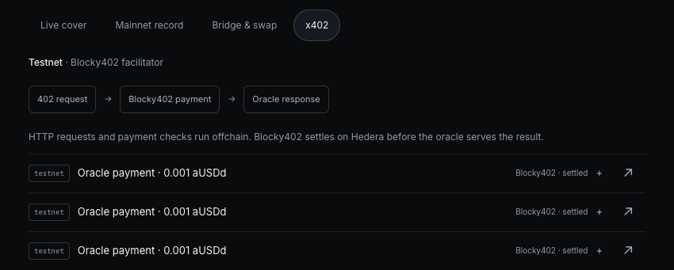
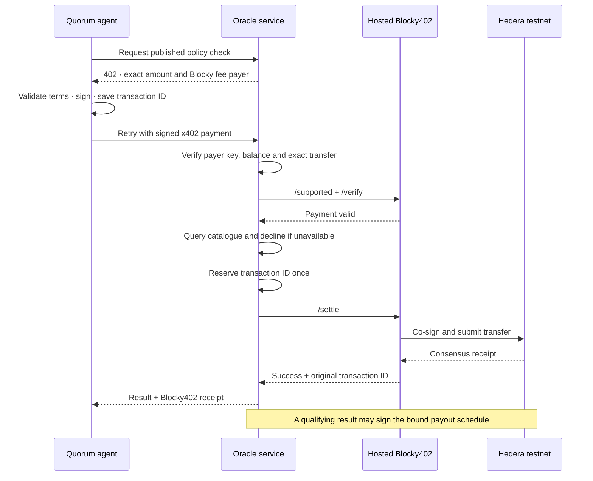

# Blocky402 · paid earthquake evidence

The policy page's **Check for earthquakes** action uses the hosted Blocky402
facilitator on **Hedera testnet**. Each oracle costs **0.001 aUSDd**, with a maximum
of **0.003 per check**. Blocky co-signs the payment and pays its network fee;
the oracle serves its result only after Blocky reports successful settlement.

## Verified live · September 8, 2026

The agent checked [Tokyo policy #32](https://quorum.aivylabs.xyz/policy/32).
All three payments reached **SUCCESS** on Hedera; Blocky's **0.0.7162784** account
paid the network fees. Total spent: **0.003 test aUSDd**. No wallet extension was needed.

| Paid source | Amount | Independent receipt |
| --- | --- | --- |
| USGS | 0.001 aUSDd | [Hedera transaction](https://hashscan.io/testnet/transaction/0.0.7162784-1788897516-226839066) |
| EMSC | 0.001 aUSDd | [Hedera transaction](https://hashscan.io/testnet/transaction/0.0.7162784-1788897523-137340394) |
| GEOFON | 0.001 aUSDd | [Hedera transaction](https://hashscan.io/testnet/transaction/0.0.7162784-1788897526-894307278) |

Each catalogue returned **no matching event**. These were paid evidence requests;
none produced a policy signature or payout. [Public evidence JSON](evidence/blocky402-testnet.json)
records discovery, exact token transfers, fee sponsorship and consensus results.



Validation: **117 tests passed** locally and on Linux. The deployed policy and
receipt views passed checks at **320, 390, 768 and 1440 px**, without horizontal
overflow or browser errors. No additional payments were sent during UI checks.

## Payment flow



| Component | Implementation |
| --- | --- |
| Hosted facilitator | [`api.testnet.blocky402.com`](https://api.testnet.blocky402.com/supported), `hedera:testnet`, fee payer **0.0.7162784** |
| Adapter | [`src/x402/blocky.js`](../src/x402/blocky.js): canonical v2 envelope, supported-network discovery, verify, settle, receipt binding |
| Paid resource | [`src/oracle/service.js`](../src/oracle/service.js): USGS, EMSC and GEOFON, both `/attest` and `/attest-and-sign` |
| Consuming agent | [`src/demo/policyChecks.js`](../src/demo/policyChecks.js): pinned recipients, token, Blocky fee payer and maximum price |
| Tests | [`tests/blocky.test.js`](../tests/blocky.test.js): ordering, refusal, mismatched receipts, concurrency and restart recovery |

The correct hosted testnet URL was missed in our earlier research. The old
`api.blocky402.com` probe described the mainnet host, not all Blocky deployments.
The September 8 `/supported` and `/health` calls confirm hosted testnet support.
[Official networks](https://blocky402.com/docs/networks/) ·
[API reference](https://blocky402.com/docs/api-reference/).

## Guardrails

- No Blocky API key, payer private key or local fee-payer signature is sent to the
  facilitator. Only the signed, exact payment and its public requirements leave
  the service. Managed demo custody remains on the shared VPS.
- The URL, network and fee payer are pinned. Discovery must match; redirects and
  unknown recipients, amounts, tokens or authorities cannot authorize spending.
- Payer signatures and balances are checked locally before catalogue work. Blocky
  verifies too. A catalogue that cannot answer declines before settlement.
- An exclusive per-transaction journal file prevents two oracle processes or a
  restart from submitting the same payment twice. Timeouts and mismatched receipts
  keep a pending record; there is no automatic resend or local-facilitator fallback.
- The hosted facilitator is an external dependency. Its reported consensus receipt
  must match the original ID, network and payer. Onchain evidence can be checked
  independently on HashScan. This does not claim independent oracle operators or
  production custody.

Old self-hosted receipts remain historical evidence. The UI identifies **Blocky402**
on new receipts; older ones are not relabeled. All current paid routes use Blocky.

## Reproduce

Use the public app: create funded testnet cover → **Check for earthquakes** →
**Source evidence & x402 receipts**. No wallet extension or mainnet funds are needed.
Alternatively, with the existing private local testnet payer configured:

```sh
node scripts/demo-x402.js --execute
node scripts/demo-x402.js --status
```

The CLI saves an ID before sending and refuses a second execution. Never delete a
pending journal to retry a payment. Its historical query cannot sign a policy.
