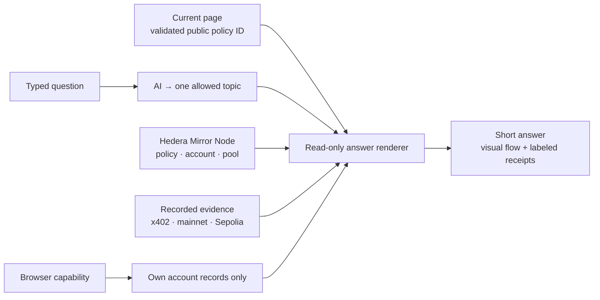

# Ask Quorum · understand the network

**[Open Quorum](https://quorum.aivylabs.xyz) → Ask Quorum.**
The small animated companion stays on the right. Its shortcuts follow the page;
open a policy to ask about that policy's status, signatures, payout or NFT.

[10-second interaction](demo-video/assets/footage/quorum-companion.mp4) ·
[Captured answer](demo-video/companion-evidence.json) · [Release checks](qa/QUORUM-COMPANION.md).

| Ask | Source and boundary |
| --- | --- |
| “What is this policy's status?” | Current Hedera schedule signatures and execution state. Unavailable reads stay unverified. |
| “Why Hedera, Axelar and Uniswap?” | Explicit network roles, the actual pool link and the separate recorded mainnet transfer. |
| “What is x402 doing?” | Blocky402 **testnet** payments, with the latest recorded receipt. Paying for data does not authorize a claim. |
| “What is my balance?” | This browser's authenticated demo account, read through Hedera Mirror Node. Chat does not create an account. |
| “How does funding work?” | Current shared-pool capital and commitments. ARPS is separate from Uniswap LP; ARPS earnings and exits remain unavailable. |
| “Swap these tokens.” | Guidance to the existing review flow. **No transaction is prepared or executed in chat.** |

The model never receives the browser capability, page context, policy data,
conversation history or signing keys. Only the typed question goes to OpenAI,
with `store: false`; this does not promise zero provider retention. Strict schema
output selects one of 13 topics. Server code supplies every displayed fact, link
and navigation destination. Quick questions skip the model entirely.

**Public is not personal:** selecting a policy permits reading its already-public
record. The companion calls it “your policy” only when a completed purchase in
the authenticated account journal matches. It does not guess ownership from the
latest public serial or a claim in the question. Monthly mandates remain in the
original Aivy browser session; Quorum cannot infer or change them.

**Live is not recorded:** current ledger readings carry their check time. The
mainnet story and recorded x402/Uniswap operation receipts retain their recorded
scope. Neither a stored receipt nor the configured network roles imply that all
external services were just health-checked. Failed reads never become invented
balances, active cover or successful payouts.

Both Aivy and Quorum share the same 12-request/minute/IP limit, three concurrent
AI interpretations and persistent 1,000-call rolling daily AI quota. Questions
are capped at 400 characters; model calls time out after 6.5 seconds. Provider,
quota or schema failures use a clearly labeled deterministic fallback. The
purchase worker and signing guards are unchanged.

| Implementation | Purpose |
| --- | --- |
| [Quorum renderer](../src/companion/quorum.js) | Validated page context, public/owner scope, specific read dependencies and deterministic answers. |
| [Shared AI boundary](../src/cover-agent/companion.js) | Topic-only model, shared admission/concurrency gate, private persistent quota and fallback. |
| [UI](../ui/src/app/QuorumCompanion.tsx) | Page-specific questions, visual flows, receipt labels, cancellation of stale responses, no transaction calls. |
| [Backend tests](../tests/quorum-companion.test.js) | Ownership, injection, network truthfulness, unavailable data, fractional x402 amounts and shared limits. |
| [Browser checks](../ui/scripts/check-companion.mjs) | All five pages, desktop/mobile/ultrawide, close paths, reduced motion and stale-response cancellation. |

The pixel robot reuses existing Aivy office art; the Quorum integration and
read-only renderer are new work. Motion respects reduced-motion preferences.
The chat closes with ×, Escape, its launcher or an outside click. It never starts
a wallet connection. Conversation exists only in the current tab's memory.
