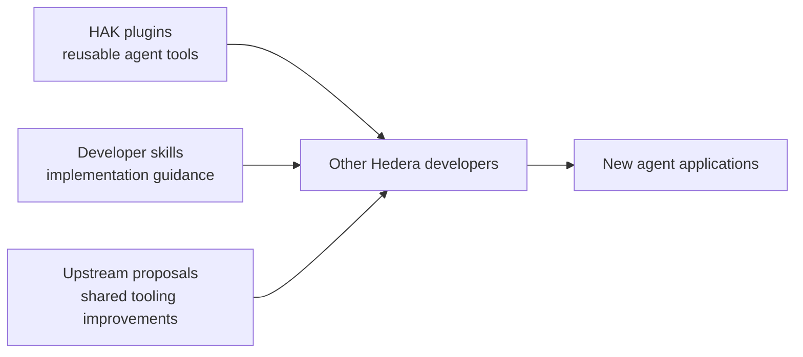

# Contributions other builders can use

**Juan Gomez (`jmgomezl`) contributes across three layers: reusable HAK plugins,
developer skills, and upstream tooling.** Quorum demonstrates how those layers
support a verifiable cover product. [Try Quorum](https://quorum.aivylabs.xyz) ·
[Judge overview](../README.md#ecosystem-contributions).

## HAK plugins used in Quorum

| Contribution | What is reusable | Exact use and evidence |
| --- | --- | --- |
| **[hak-scheduled-settlement](https://github.com/jmgomezl/hak-scheduled-settlement)** · new this event | Nested committer + attester keys, conditional-settlement tools and expiry guard. Useful for conditional payments beyond insurance. | Quorum imports `settlementAccountKey`, `attesterQuorumKey` and `MAX_EXPIRY_SECONDS`. [Key builders](../src/pool/keys.js) · [Payout](../src/policy/payout.js) |
| **[hak-uniswap-plugin](HAK-UNISWAP.md)** · prior work | Uniswap swap tools for Hedera Agent Kit developers, distributed through npm. | Quorum's locked GitHub 0.2.0 version supplies `uniswap_quote` for Base/Unichain. Sepolia execution uses Quorum's guarded adapters. [Call site](../src/settlement/crossAsset.js#L65) · [233 npm downloads, dated snapshot](evidence/hak-uniswap-package.json) |
| **[hak-axelar-plugin](https://github.com/jmgomezl/hak-axelar-plugin)** · prior work | ITS token transfers and GMP cross-chain messaging for HAK agents. | Quorum consumes npm 1.0.1 and calls the `axelar_send_token` builder, then validates and signs the result. [Adapter](../src/settlement/axelarPlugin.js) · [Tests](../tests/axelar-plugin.test.js) · [Delivery receipt](evidence/hak-axelar-plugin.json) |

The settlement plugin is consumed from GitHub; it is not currently published on
npm. Quorum uses its exported helpers and builds schedules with the SDK. It does
not run the plugin's full HAK tool-calling agent. The Uniswap npm release is 0.1.0;
its newer GitHub quote tool is disclosed separately. [Locked versions](evidence/ecosystem-contributions.json).

## Developer skills

| Authored skill | What it teaches | Use and status |
| --- | --- | --- |
| **[`hedera-mirror-node` · PR #16](https://github.com/hedera-dev/hedera-skills/pull/16)** | Read transactions, balances, NFTs and HCS data with correct pagination, units and consistency handling. | **Applied to Quorum's review.** Exact token filters, integer preservation and unavailable-state handling are mapped to fixes and tests in [MIRROR-NODE.md](MIRROR-NODE.md). Submitted July 9; prior work; PR open. |
| **[`hedera-accounts-keys` · PR #29](https://github.com/hedera-dev/hedera-skills/pull/29)** | Explain key parsing, account/address forms and threshold-key semantics using SDK examples and evals. | **Related developer contribution.** Submitted September 4; PR open. No claim that Quorum applied this skill or that it is new Quorum event work. |

Skills are development guidance, not deployed financial agents or signing
dependencies. PR #16's reviewed source is
[`378c1b4`](https://github.com/jmgomezl/hedera-skills/tree/378c1b4f169e6df26c293e99f52eb3095bfc7e05);
PR #29's source is [`b5c73c3`](https://github.com/jmgomezl/hedera-skills/tree/b5c73c39d5f3484c63dafe7f99dfe2d8adab980b).

## Upstream improvement prompted by this build

Quorum needed an account with multiple required signers. That exposed a gap in
HAK account creation, leading to **[issue #1087](https://github.com/hashgraph/hedera-agent-kit-js/issues/1087)**
and **[PR #1088](https://github.com/hashgraph/hedera-agent-kit-js/pull/1088)** on September 4.

The proposal adds `publicKeys` and `threshold` for **flat** key lists and m-of-n
accounts, with unit and integration tests. It remains **open, not merged**.
Quorum's nested `agent AND 2-of-3` structure is supplied by the separate settlement
plugin; this PR does not implement nested keys or power the deployed app.

## New product work connecting these contributions

| Built for this event | Inspect |
| --- | --- |
| Published policy terms, hazard pricing and signature-gated cover | [Issuance](../src/policy/issue.js) · [Oracle verification](../src/oracle/verify-policy.js) |
| Blocky402-paid, policy-bound oracle checks | [Payment flow and receipts](BLOCKY402.md) |
| Scoped demo wallets, guarded cross-chain execution and Uniswap V3 lifecycle | [Managed flows](MANAGED-DEMO-WALLETS.md) · [LP receipts](evidence/uniswap-liquidity.json) |
| Persistent admission budgets, recovery journals and read verification | [Agent security](AGENT-SECURITY.md) · [Mirror review](MIRROR-NODE.md) |
| Aivy Labs monthly-cover canvas, deterministic worker and read-only companions | [Aivy integration](COVER-AGENT.md) · [Quorum companion](COMPANION.md) · [Aivy event diff](https://github.com/jmgomezl/aivy/compare/6ddc263...e95e50f) |

Blocky402, Hedera, Axelar and Uniswap are external technologies; the contribution
here is their implementation and integration, not authorship of those protocols.

## Earlier ecosystem work

These repositories show the broader contribution history. **They are not Quorum
runtime dependencies or claimed as new work for this submission.**

| Earlier work | Capability / source |
| --- | --- |
| **SaucerSwap HAK plugin** | Hedera DEX quotes, swaps and liquidity · [JavaScript, now under hedera-dev](https://github.com/hedera-dev/hak-saucerswap-plugin) · [Python edition](https://github.com/jmgomezl/hak-saucerswap-plugin-py) |
| **Pyth HAK plugin** | Price-feed lookup · [Source](https://github.com/jmgomezl/hak-pyth-plugin) |
| **Stader HAK plugin** | HBARX liquid-staking integration · [Source](https://github.com/hedera-dev/hak-stader-plugin) |
| **LayerZero HAK plugin** | Cross-chain messaging tools · [Source](https://github.com/jmgomezl/hak-layerzero-plugin) |
| **Ledger HAK plugin** | Hardware-wallet approval for EVM actions · [Source](https://github.com/jmgomezl/hak-ledger-plugin) |
| **GitHub Pay HAK plugin** | HBAR contributor payments with policy and receipt records · [Source](https://github.com/jmgomezl/hak-plugin-github-pay) |
| **CoinCap Python plugin** | Market-data access for HAK Python · [Source](https://github.com/jmgomezl/coincap-hedera-plugin-py) |
| **Aivy / Aivy Studio** | Earlier agent application, orchestration and canvas foundations · [Aivy](https://github.com/jmgomezl/aivy) · [Studio](https://github.com/jmgomezl/aivy-studio) |

SaucerSwap and Pyth appear in the [published Hedera Agent Kit README](https://www.npmjs.com/package/hedera-agent-kit?activeTab=readme)
at tested versions 1.0.1 and 0.1.1 respectively. That listing does not mean every
later release or the other plugins above has been endorsed.

**Verification date: September 10, 2026.** All three linked PRs are open.
[Status and dependency snapshot](evidence/ecosystem-contributions.json) ·
[Full prior-work disclosure](PRIOR-WORK.md) · [AI assistance attribution](AI-ASSISTANCE.md).
