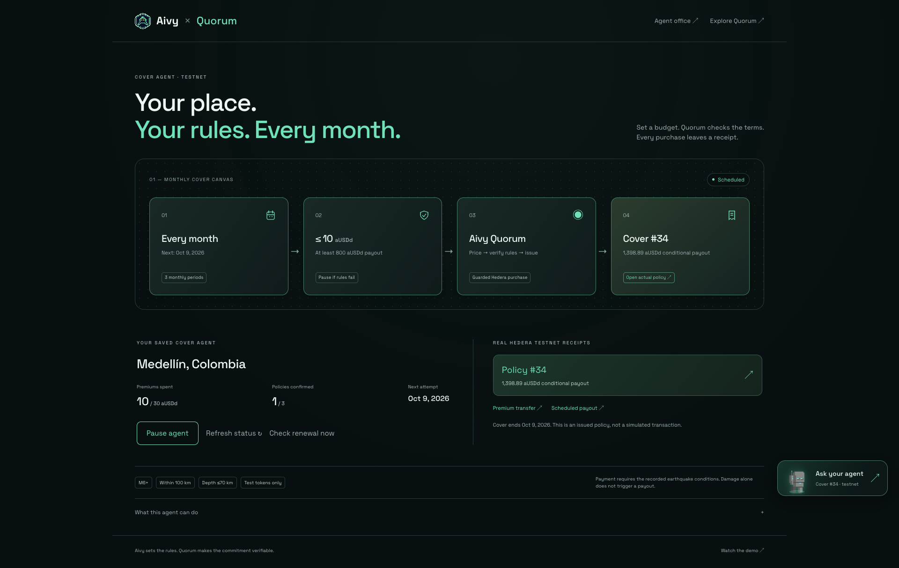
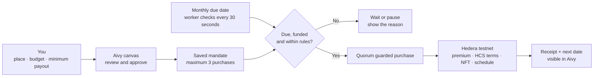
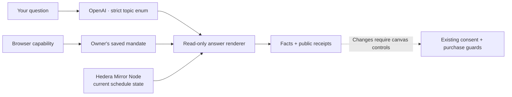

# Aivy → Quorum · monthly cover agent

**[Open the canvas](https://aivylabs.xyz/quorum). Set a place, a budget and a minimum payout.**
Approve up to three monthly testnet purchases. The first runs on activation;
later purchases use the same saved rules. Every completed purchase links to its
real Hedera policy, NFT and transaction evidence. Pause stops new purchases.

*Actual first purchase: 10 aUSDd → 1,398.89 aUSDd conditional payout.
[Policy #34](https://quorum.aivylabs.xyz/policy/34) ·
[Verified receipts and pause/reload checks](demo-video/cover-agent-evidence.json).
The next date is a planned purchase, not an executed transaction.*

## What is actually running?

| Part | Implementation and boundary |
| --- | --- |
| Aivy | A dedicated `/quorum` canvas linked from the homepage and agent office. It saves typed consent, displays execution state and controls pause/resume. |
| Quorum | A deterministic worker persists the mandate and checks due purchases every 30 seconds, including when the browser is closed. |
| First purchase | Real testnet premium debit, recorded terms, cover NFT and scheduled payout through the existing issuer. |
| Future date | A planned attempt, **not a transaction receipt or guarantee of continuous cover**. |
| Purchase runtime | Does not use an LLM, AWS KMS or AivyVault. Signing and custody remain with Quorum's demo service. |
| Cover companion | A separate read-only chat. AI selects a question topic; Quorum renders facts and receipts for the authenticated browser's latest policy. |
| Earthquake checks | Still requested from a policy page. The purchase scheduler does not monitor earthquakes or approve claims. |

## Limits are checked in code

| Guard | Enforcement |
| --- | --- |
| Scope | Hedera **testnet**, exact registered aUSDd token, three supported cities. No arbitrary network, recipient, URL, signer or tool input. |
| Spending | 1–10 aUSDd per monthly period, at most three successful purchases: **30 aUSDd maximum premiums**. Sponsored fees also remain subject to existing global demo limits. |
| Minimum payout | User-approved integer between 1 and 2,000 aUSDd. A fresh quote is checked before capacity queries and again immediately before ledger admission. Below the minimum: pause without purchase. |
| Conditions | M6+, within 100 km, depth ≤70 km. The fixed monthly budget can buy a different payout at renewal; the minimum still applies. |
| Ownership | The mandate binds to the original demo funding account. Each policy retains Quorum's separate service-managed beneficiary and NFT account. |
| Duplicate prevention | A persisted request ID per monthly cycle, a reserved API namespace, a serial worker and the existing issuance lock/book. Refresh, repeated activation and “Check renewal now” cannot create another completed purchase in the same period. |
| Uncertain transaction | Keep the original request and pause for operator review. On restart, only a completed authoritative policy-book entry can resolve an interrupted attempt automatically. |
| Pause | Stops new admission. A transaction already admitted to Hedera may still finish. |

The instruction is structured rather than free-form. A future language model can
propose these fields; it must not bypass the consent or purchase boundary.

## Ask your agent, without granting it spending power

Open the animated companion at the right of the canvas. Try **“What is my policy
status?”**, **“When is my next renewal?”** or **“How much have I spent?”** Quick
questions read the same records without a model call. The pixel agent reuses
Aivy's existing office sprite art; motion respects the reduced-motion setting.

| Boundary | What enforces it |
| --- | --- |
| No model authority | The pinned model returns **one of nine topics**, never answer text, links, parameters or tools. Server code renders the response. It cannot buy, pause, transfer or sign. |
| Owner isolation | The browser capability selects the mandate. The endpoint rejects client-supplied policy IDs, state and extra fields. Anonymous questions receive onboarding only. |
| Current status | Ledger state comes from Mirror Node. An unavailable read is shown as **unverified**, never active or paid. Future purchases remain planned dates. |
| Bounded AI usage | 400 characters per question, 12 requests/minute/IP, three concurrent interpretations and a persistent 1,000-call rolling daily cap. 6.5-second model timeout; deterministic fallback if unavailable. |
| Privacy | Only the typed question goes to OpenAI, with `store: false`; no account capability, policy data, conversation history or signing keys. Quick questions skip AI. This is not a claim of zero provider retention. |
| Honest fallback | The panel distinguishes AI-interpreted, direct and fallback answers. It does not pretend a model answered when the provider or quota is unavailable. |

The model uses [strict Structured Outputs](https://developers.openai.com/api/docs/guides/structured-outputs)
for intent classification. This is a constrained policy companion, not a
general-purpose adviser or a language model controlling the renewal worker.

## Calendar and custody

- Calendar months preserve the original UTC day, clamping short months: January 31 → February 28 → March 31. Policy terms are 28–31 days accordingly.
- The worker skips missed monthly periods instead of buying a backlog. It waits for the prior policy to expire before a later purchase. Outages, failed rules, depleted budgets and delayed execution can leave gaps.
- A mandate is immutable after approval. Pause/resume changes its running state, not its spending rules. It ends after three monthly periods even if some purchases were skipped.
- The browser stores a private access capability. Losing browser storage does **not** cancel future purchases; pause before clearing it. This is service-managed testnet custody, with the same trust boundary as the Aivy origin.
- aUSDd and the resulting cover are a demonstration, with no cash value. This is not production insurance, independent signing or an HSM-backed agent.

## Source and deployment

| Code | Role |
| --- | --- |
| [Aivy canvas](https://github.com/jmgomezl/aivy/blob/main/src/components/QuorumCanvas.tsx) | Review, explicit consent, activation, actual receipts and pause/resume. |
| [Rules](../src/cover-agent/rules.js) | Typed limits, calendar calculations and fresh-quote checks. |
| [Service](../src/cover-agent/service.js) | Deterministic scheduling, cycle claims and recovery. |
| [Store](../src/cover-agent/store.js) | Private atomic journal and short state transactions. |
| [Companion](../src/cover-agent/companion.js) | Topic-only AI, authenticated read-only answers, rate and quota bounds. |
| [Companion tests](../tests/cover-companion.test.js) | Injection, owner selection, unavailable ledger, action denial, fallback and persistent quota. |
| [Shared purchase adapter](../src/demo/purchase.js) | Same guarded issuer used by normal Quorum purchases. |
| [Server](../src/server.js) | Capability-authenticated routes, worker lifecycle and graceful drain. |
| [Tests](../tests/cover-agent.test.js) | Duplicate attempts, price changes, owner isolation, pause, month boundaries and restart recovery. |

Aivy proxies only `/api/quorum/` to Quorum's loopback
`/api/cover-agents/` routes. Its older `/api/` backend stays separate.
See the [Nginx location](../deploy/nginx-aivy-quorum.conf).

Run one Quorum worker. Preserve `.artifacts/cover-agents-testnet.json`, its
`.initialized` marker and lock files together with the existing demo and policy
journals. Missing or invalid state disables this feature instead of starting an
empty purchase history. `COVER_AGENTS_ENABLED=0` disables the worker explicitly.

Set `OPENAI_API_KEY` in the private Quorum service environment for typed-question
interpretation. It is never a frontend variable. Preserve
`.artifacts/cover-companion-ai.json`, its `.initialized` marker and lock with the
other journals; losing an initialized quota journal disables AI calls rather
than resetting its budget. Quick questions and deterministic fallback still work.

Validation: `node --test tests/cover-agent.test.js`; calendar and restart cases
use a fake clock and mocked issuer. They do not claim future onchain execution.
The Aivy browser check exercises five screen widths, consent, receipts,
pause/resume, reload and isolation from the legacy wallet bundle.
