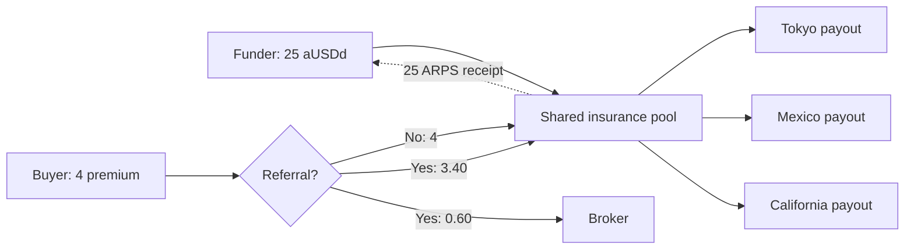
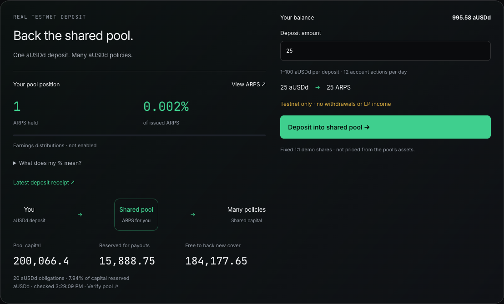

# Funding economics · what your deposit actually does

**Today you fund one shared aUSDd pool. You cannot earmark a deposit for Tokyo,
Mexico City or another individual policy.** Those cards explain a proposed
per-policy model. ARPS is a real testnet token, with fixed 1:1 demo issuance;
it currently provides no withdrawal or profit-distribution function.

| Choice | Where the money goes | What you receive | Income / exit today |
| --- | --- | --- | --- |
| **Fund the shared pool** | One Hedera account backing many aUSDd policies | Fungible ARPS | Not implemented |
| **Open a policy's funding estimate** | No money moves | An illustration, not an NFT | Not implemented |
| **Provide Uniswap liquidity** | A separate Sepolia trading pool | A real Uniswap V3 position NFT | Swap-fee collection and liquidity withdrawal |



Premium transfers are atomic. Cover payouts require the recorded earthquake
conditions and the agent + oracle signature gate. A paid oracle query is a
separate expense for the requesting demo account; it is not premium income.
Blocky402 sponsors the query payment's network fee.



## The numbers, with one small example

Suppose a policy has an **800 payout**, an **8 premium**, a **30-day term** and
a broker. The hypothetical funder supplies **200**, or **25%** of its payout target.

| Calculation | Result |
| --- | --- |
| Broker: 8 × 15% | **1.20** |
| Pool premium: 8 − 1.20 | **6.80** |
| Funder's hypothetical premium share: 6.80 × 25% | **1.70** |
| No qualifying payout, after expiry: 200 + 1.70 | **201.70**, before costs |
| Payout triggers: 200 − 200 + 1.70 | **1.70**, before costs; **99.15% loss** |

This assumes funding from issuance through the complete term, and proportional
allocation of both premium and payout risk. It is **not an offer to join an
already-issued policy**. The current shared pool does not allocate these amounts
to individual ARPS holders.

**Premium is not profit.** Under this project's 50% modeled loss ratio, the same
example assumes a 0.5% event probability: 800 × 0.5% = **4 expected loss**.
The pool's modeled margin is **6.80 − 4 = 2.80 before costs**; a hypothetical 25%
allocation gives **0.70**, not 1.70 of expected profit. This is a model average,
not either individual's realized outcome or a validated forecast.

The old **10.34% annual premium rate** is merely 0.85% × 365 ÷ 30. It assumes
continuous renewals at identical prices with no claims, costs, compounding or
idle capital. It is neither expected return nor APY. The app now leads with
the actual term and keeps this comparison inside **Numbers & assumptions**.

## How cover is priced

```text
Event probability = 1 − exp(−loaded annual event rate × days / 365.25)
Modeled claim cost = payout × event probability
Buyer premium     = modeled claim cost / 0.50
Payout for budget = budget × 0.50 / event probability
```

The loaded rate comes from historical shallow M6+ events in a 300 km reference
area, scaled to a 100 km trigger area, with a count-uncertainty adjustment.
[Pricing implementation](../src/pricing/hazard.js).

The **50%** is a pricing assumption against the **buyer's gross premium**.
With a broker, the pool receives 85%; its modeled loss ratio against that income
is **50 ÷ 85 = 58.82%**. A 4 premium therefore leaves **2** before costs without
a broker, or **1.40** with one. No separate platform fee is currently collected.

The 0.10 issuance-cost assumption is not a measured operating-cost ledger.
Including a 15% broker, an illustrative break-even premium would be
0.10 ÷ (1 − 0.50 − 0.15) = **0.2857**, versus the code's broker-free 0.20 floor.
The public minimum premium is **1**, so this discrepancy does not admit a current
public quote below that illustrative floor. It must be revisited before lowering
the minimum or making commercial margin claims.

## Pool capacity is not pool profit

**Capacity is calculated separately for each asset.**

```text
Available for new cover = same-asset balance − active promised payouts
New promised payout    ≤ available capacity before collecting its premium
```

The issuance lock serializes reservations; uncertain issuances retain their
reservation. A payout reduces balance and releases the corresponding obligation;
expiry releases the obligation without moving funds. Premiums arrive upfront,
but remaining cover obligations still need capital. Operator top-ups are funding,
not earned premiums. No new deposit is counted as revenue.

The September 8 review found legacy HBAR tinybars being counted as aUSDd base
units. **Fixed in both the API and issuance guard:** 81.39615783 HBAR was adding
8,139.615783 to the aUSDd commitment. Unknown asset records now pause capacity
calculation; new records preserve the exact asset identity.

| Verified snapshot · September 8 | Amount |
| --- | --- |
| aUSDd pool balance | **200,066.40** |
| Active aUSDd payout commitments | **15,888.748739** across **20** policies |
| aUSDd free capacity | **184,177.651261** |
| Fraction of aUSDd balance reserved | **7.94%** |
| Separate legacy HBAR commitments / HBAR balance | **81.39615783 / 360.40485636 HBAR** |

Low utilization matters: a fully-funded policy's premium/capital ratio cannot be
applied to the whole pool balance. An illustrative portfolio margin is
`(earned pool premiums − incurred claims − operating costs) / average equity`.
For the 20 active aUSDd policies reviewed, full-term premiums reaching the pool
total **78.40** and modeled claim costs total **39.50**: **38.90 before operating
costs** over their 30-day terms. Repeating that same book without idle gaps would
be roughly **0.24% per year on the current balance**, before costs—not the much
higher annual premium ratio on an individual fully-funded Tokyo policy. This
comparison is not realized profit or an available ARPS return.
Current historical policies and operator subsidies do not establish a sustainable
portfolio return. One earthquake can trigger several nearby policies, so geographic
labels alone do not establish independent risks.

## What ARPS means—and what remains to build

The checked deposit really moved **25 aUSDd into the pool and 25 ARPS to its funder
in one transaction**. At the reviewed supply of **50,711 ARPS**, that is
**0.0493% of issued tokens**. It is not 0.0493% of a guaranteed payout, APY or
redeemable pool assets. Treasury shares are included in issued supply.

The pool also contains a large operator top-up without matching LP issuance,
historical deposits in different assets, premiums and claim payments. Dividing
its balance by ARPS supply does **not** establish a legitimate redemption price.

For a complete investor product, keep the shared-pool model and implement:

1. **Equity accounting:** identify seed ownership, separate asset books, earned
   premium, claim liabilities and expenses. Share price = net assets ÷ eligible
   shares; new shares = deposit ÷ pre-deposit price. Decide how legacy demo
   balances would be excluded or migrated before enabling real-value funding.
2. **Profit treatment:** either retain profit in share value or distribute it;
   distributions must reduce share value to avoid counting the same profit twice.
3. **Exit rules:** redemption cannot spend capital reserved for cover. Add an
   expiry-aware queue, loss allocation and a separate constrained withdrawal
   authorization path. A secondary sale would require an actual buyer or market;
   ARPS is not the token traded in the current Uniswap pool.
4. **Risk and cost validation:** backtest calibration, clustering and geographic
   concentration; measure costs and stress correlated claims before setting
   investor return expectations.

Actual per-policy funding would be a separate product: a segregated policy or
cohort balance, a funding deadline, receipt ownership, premium entitlements and
claim/expiry settlement. A card and percentage slider cannot create that isolation.

## Verify

[Live deposit page](https://quorum.aivylabs.xyz/policies?view=fund) ·
[Public ledger and pricing evidence](evidence/funding-economics.json) ·
[Exposure accounting](../src/pool/exposure.js) · [Economic regression tests](../tests/economics.test.js).

**Verified:** 122 tests passed locally and on Linux. Public funding and policy
views passed at 320, 390, 768 and 1440 px; authenticated ARPS balances and their
holding percentage were checked at 320 and 1440 px. No new ledger writes were
made for this review.

Run `node scripts/audit-economics.js --require-api-match` for a fresh read-only
comparison of public HCS prices, premium transfers, a real deposit, token supply
and pool capacity. It makes no ledger writes.

Terminology references: [NAIC loss ratio and earned premium definitions](https://content.naic.org/glossary-insurance-terms)
and [Investor.gov net asset value](https://www.investor.gov/introduction-investing/investing-basics/glossary/net-asset-value).
These clarify the accounting terms; they do not validate this earthquake model.
