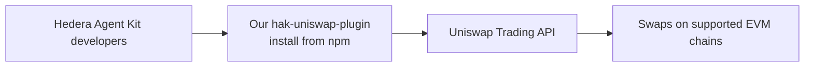

# Our Uniswap plugin for Hedera Agent Kit

**A reusable path from Hedera agents to Uniswap liquidity.** Juan Gomez developed
`hak-uniswap-plugin` so other Hedera Agent Kit (HAK) developers can add EVM swaps
to their agents. Quorum is a concrete application of that broader developer contribution.



The plugin handles the Uniswap interaction. Execution needs funded assets and a
signer on the destination EVM chain. In Quorum, the separate HAK Axelar plugin
transports Hedera demo tokens there; Uniswap supplies the swap liquidity.

## Published and reusable

```sh
npm i hak-uniswap-plugin
```

| Evidence | Verified September 10, 2026 |
| --- | --- |
| Author / license | Juan Gomez (`jmgomezl`) · MIT |
| npm release | **0.1.0**, published June 13, 2026 · [registry](https://registry.npmjs.org/hak-uniswap-plugin) |
| Package reach | **233 npm downloads**, June 13–September 9 · [dated npm count](https://api.npmjs.org/downloads/point/2026-06-13:2026-09-09/hak-uniswap-plugin) |
| Published swap tool | `uniswap_swap`: Trading API route, ERC-20 allowance handling and optional Ledger approval threshold |
| Source / installation | [GitHub](https://github.com/jmgomezl/hak-uniswap-plugin) · [npm](https://www.npmjs.com/package/hak-uniswap-plugin) |

Downloads measure package distribution, **not unique developers, active users or
swap volume**. The value is that other HAK applications can reuse the integration.
[Verification snapshot](evidence/hak-uniswap-package.json).

## How Quorum uses it

| Layer | Actual implementation |
| --- | --- |
| HAK Uniswap plugin | Quorum locks the GitHub **0.2.0** revision, which adds `uniswap_quote`. Its live Base/Unichain USDC-to-ETH quotes call that tool. [Call site](../src/settlement/crossAsset.js#L65) · [locked revision](https://github.com/jmgomezl/hak-uniswap-plugin/tree/05bdc45ec1dbe6b142132dd1e81d6cec8457a58e) |
| Hedera → Sepolia transport | The separate HAK Axelar plugin builds ITS transfers. [Guarded adapter](../src/settlement/axelarPlugin.js) |
| Sepolia swap execution | Quorum's adapter calls the Trading API and validates the prepared transaction before scoped signing. [Swap adapter](../src/settlement/bridgedSwap.js) |
| V3 positions | Quorum's LP API adapter implements create, increase, collect and remove. [Liquidity adapter](../src/settlement/liquidity.js) |

The npm 0.1.0 release and Quorum's locked GitHub 0.2.0 dependency are distinct.
Quorum's public execution flow uses its guarded adapters; it does not invoke the
plugin's general-purpose swap signer. Mainnet previews remain quote-only.

**Contribution boundary:** npm 0.1.0 and its `uniswap_swap` tool are prior work.
On **September 5, 2026**, commit `05bdc45` added the **`uniswap_quote` tool** in
GitHub 0.2.0: request a price and unsigned transaction without an EVM private key,
token approval or broadcast. It also added transient API retries and quote-tool
tests. [Exact event diff](https://github.com/jmgomezl/hak-uniswap-plugin/compare/77e001e588b524930369f1eab30858a3c81d5d49...05bdc45ec1dbe6b142132dd1e81d6cec8457a58e).

This quote-only entry point lets a Hedera agent inspect EVM liquidity before
requesting execution. Quorum consumes that exact revision, then adds its own
guarded cross-chain adapters, funded judge flows and verifiable swap/LP receipts.
**The new 0.2.0 code is consumed from GitHub; the published npm release remains 0.1.0.**
[Commit dates, changed files and dependency verification](evidence/uniswap-continuity.json). [Prior work](PRIOR-WORK.md) · [Uniswap evidence](../README.md#why-uniswap).
