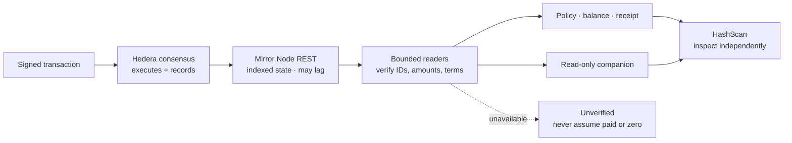

# Mirror Node: evidence behind the interface

**Hedera executes. Mirror Node reports. The companion explains verified reads.**



No signing key is required for these public GET requests. Mirror Node is a read
service; it does not sign, execute a transfer, validate earthquake truth, or give
the AI authority over funds.

## Where Quorum uses it

| User sees | Actual Mirror read | Code |
| --- | --- | --- |
| Policy status and oracle signatures | `/schedules/{id}` | [Ledger reader](../src/ledger.js) |
| Balance, ARPS and pool capital | `/accounts/{id}/tokens?token.id={token}` | [Demo account](../src/demo/service.js), [pool API](../src/server.js) |
| Bound policy terms before an oracle signs | Topic entity, base64 messages and schedule body | [Policy verifier](../src/oracle/verify-policy.js) |
| Deposit recovery | Exact transaction, successful result and four expected token transfer legs | [Reconciliation](../src/demo/reconcile.js) |
| Paid oracle request validation | Payer account key, token relationship and available units | [x402 verification](../src/x402/facilitator.js) |
| Axelar source execution evidence | ITS contract address and call result | [Bridge](../src/settlement/bridge.js) |
| Recorded mainnet NFT and payout evidence | NFT owner/metadata, supply, account and schedule | [Browser readers](../ui/src/lib/mirror.ts), [record](../ui/src/data/mainnet.json) |
| “What is my policy status?” | Owner-bound or explicitly public policy reads through the same server readers | [Quorum companion](../src/companion/quorum.js), [Aivy integration](COVER-AGENT.md) |

## Applying our Hedera developer skill

Juan Manuel Gómez López authored **[hedera-skills PR #16](https://github.com/hedera-dev/hedera-skills/pull/16)**,
which adds the **`hedera-mirror-node`** skill. We read and applied
[version `378c1b4`](https://github.com/jmgomezl/hedera-skills/blob/378c1b4f169e6df26c293e99f52eb3095bfc7e05/plugins/mirror-node/skills/hedera-mirror-node/SKILL.md)
during this September 10, 2026 review.

| Skill guidance | Concrete application |
| --- | --- |
| List endpoints return pages, not every holding | Replaced the demo account's first-page token lookup with two exact token filters. Unrelated holdings cannot hide aUSDd or ARPS. |
| JSON parsing can round large integer balances | The shared server reader uses Node 22's `JSON.parse` source context to retain oversized integer literals as exact strings. Existing `BigInt` receipt/payment checks receive the original digits. |
| Missing/indexing data is not a zero balance | Known demo-token and pool relationships must be present and valid. Missing, malformed or incomplete responses fail the read; a verified zero remains zero. |
| Number conversion needs a defined range | Demo account and pool balance displays reject units above `Number.MAX_SAFE_INTEGER` instead of silently rounding them. |
| Callers use both SDK entities and stored IDs | The submission review found the pool reader passing an SDK `AccountId` to a string-only validator. The reader now normalizes known `AccountId`/`TokenId` instances before applying the same strict ID checks; arbitrary objects remain rejected. |
| Mirror data can lag consensus | 404 is identified as missing or not yet indexed; policy reads remain unavailable, not active, paid or expired by assumption. No automatic replacement payment is submitted. |
| Follow `links.next` for multi-page data | Reviewed existing HCS reconstruction: it follows same-topic cursors, rejects foreign/repeated cursors, checks chunk identity and stops at a bounded limit. Incomplete terms cannot authorize a payout. |
| Keep public reads bounded | Existing eight-second timeout, schedule cache and in-flight request sharing remain. 429/5xx fail unavailable; this change adds no automatic retry loop. |

**Attribution boundary:** the skill predates this event and PR #16 was still open
on September 10. It is development guidance applied to this review, not an
installed production dependency. Mirror Node integration already existed; we do
not claim the skill originally built it. Quorum's fixes and verification here are
event work; the skill is disclosed as prior work in the README.

## Verify without spending anything

With dependencies installed and Node 22+, from the repository root:

```sh
node --test tests/mirror-reads.test.js tests/policy-chunks.test.js
node scripts/verify-mirror-reads.mjs
```

The script uses public GET requests only, with no wallet or `.env`. The
[September 10 result](evidence/mirror-node-review.json) checks:

1. Testnet policy **#34**: HCS terms match the committed payout body and agent signature.
2. Its HTS NFT belongs to the recorded beneficiary and points to those same terms.
3. The successful premium transaction credits the expected token amount to the pool.
4. The pool's aUSDd balance is read with an exact token filter.
5. The **recorded** mainnet 4 HBAR transfer matches the executed schedule and both transfer legs.

The original transfer's terms are checked at issuance time; today's schedule
execution/deletion fields are reported separately. This is receipt verification,
not a claim that an expired policy remains active. Pass another public policy
serial as the script's first argument if testnet history is reset.

**Validation:** all 161 backend tests passed after the change, including five new
read-path regressions. The live checks submitted no transactions. Testnet cover
and the September 4 mainnet demonstration remain explicitly separate.

**Scope:** the exact parser covers `src/ledger.js` consumers. Older browser-only
mainnet display readers and the Axelar contract reader are separate implementations;
this review does not claim a complete arbitrary-precision conversion of the app.
Public Mirror availability and indexing still limit freshness. Responses carry
check timestamps; they are observations, not atomic snapshots or cryptographic
proofs supplied by the model.

**Submission follow-up:** [September 10 review](qa/SUBMISSION-REVIEW.md) includes
the SDK-entity regression and rechecks the live pool endpoint. The 161-test count
above is the original Mirror Node review, not the later expanded suite.
