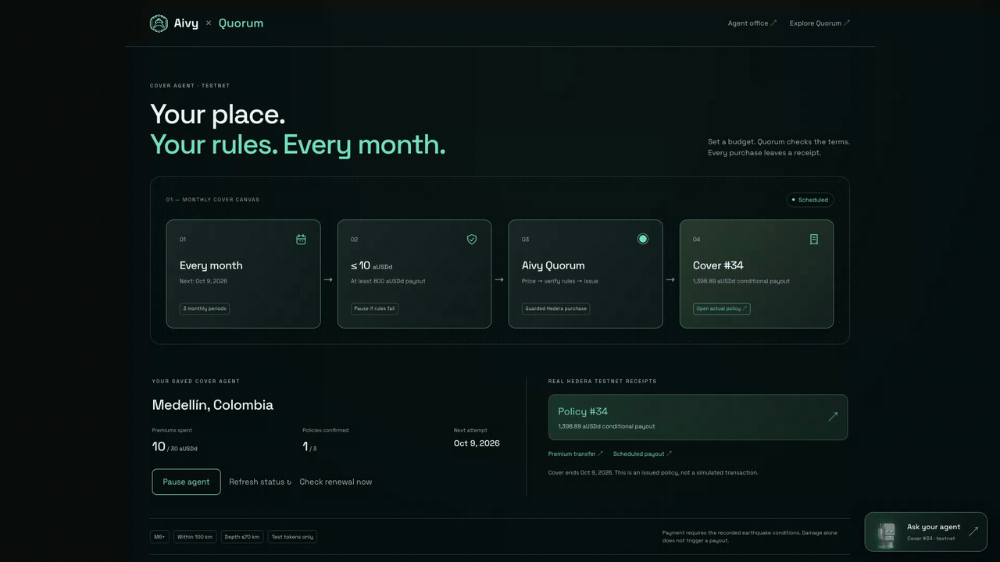

# Aivy Quorum · submission and recording guide

Aivy Quorum commits an earthquake payout before an event. The agent signs a
Hedera Scheduled Transaction; two of three oracle keys complete the authorization
and the network executes it. The app makes the terms, NFT and receipts visible.

[Live demo](https://quorum.aivylabs.xyz/) ·
[Application repository](https://github.com/jmgomezl/aivy-parametric-pool) ·
[Reusable settlement plugin](https://github.com/jmgomezl/hak-scheduled-settlement) ·
[Aivy integration source](https://github.com/jmgomezl/aivy).

**Repository review:** [September 10 findings and checks](qa/SUBMISSION-REVIEW.md).
The main README now leads with the problem, sponsor-specific code and verifiable
results. Full [prior-work disclosure](PRIOR-WORK.md), [design decisions](DESIGN.md)
and [development details](DEVELOPMENT.md) remain available separately.

**Prepared video kit:** [3:59 visual edit, timed script and rehearsal page](demo-video/README.md).
It includes newly recorded testnet issuance, Blocky402 checks, a deposit and a
confirmed Uniswap swap, plus a short [Aivy monthly-agent interaction](COVER-AGENT.md)
with real policy #34, and a typed question to the Quorum companion. The monthly
Aivy journey starts at **2:57**; Quorum’s status question is at **3:21** and its
Mirror Node evidence at **3:29**. **Human narration is still required** before submitting
the edit. Its new bridge source is confirmed but delivery was pending at capture;
the swap uses previously bridged starter tokens. [Recording receipts](demo-video/EVIDENCE.md).

Latest [QA and judge review](qa/JUDGE-REVIEW.md); earlier [security review](qa/SECURITY-FINAL.md) and [UX review](qa/READINESS-REVIEW.md). Keep the recording focused
on one complete cover journey and the Hedera → Uniswap path; technical evidence
is one disclosure away. No extension or faucet setup is needed in the public app.

**Technical evidence:** [Mirror Node integration and reproducible read-only checks](MIRROR-NODE.md)
show how signatures, balances, NFT ownership and receipts support the UI and
companion. The review applies our pre-existing [Hedera skill PR #16](https://github.com/hedera-dev/hedera-skills/pull/16);
credit it as development guidance and prior work, not a new event contribution.

## Aivy Labs integration · show the complete loop

**[Aivy Labs](https://aivylabs.xyz/quorum) sets the rules. Quorum creates the policy.
Both sites help the user verify it.**

The new canvas supports a place, monthly premium limit and minimum payout, with
explicit approval for up to three periods. Its deterministic Quorum worker runs
when the browser is closed. The first testnet purchase is real; later dates remain
planned attempts. The companion answers policy questions and links evidence,
without signing or changing the plan.

**Novelty boundary:** Aivy's earlier app and robot art are prior work. The dedicated
canvas, Quorum scheduling adapter, guards and read-only companions are event work.
This flow uses Quorum's demo custody, not Aivy's older KMS/vault runtime.
[Architecture](COVER-AGENT.md) · [Companion](COMPANION.md) · [Capture notes](media/README.md).

## Alternative 3-minute 15-second live walkthrough

| Time | Screen / action | Explain |
| --- | --- | --- |
| 0:00–0:20 | Cover homepage | Fixed earthquake payouts can be committed before an event. |
| 0:20–0:45 | Search Medellin; Explore data | The historical chart holds payout at $800; premiums vary with the record. Return to cover for current terms. |
| 0:45–1:15 | Create funded testnet cover; view policy | A real NFT, published terms, premium transfer and scheduled payout. Demo assets have no cash value. Cut network waiting from the recording. |
| 1:15–1:35 | Swap → Bridge / Swap | Hedera → HAK Axelar plugin → Sepolia → Uniswap. Use the funded demo: real bridge, approval and swap receipts without an extension. |
| 1:35–2:00 | Fund the pool → deposit and ARPS balance | One shared pool backs all policies. ARPS arrives atomically. Per-policy cards are economics previews; no separate vault or guaranteed yield. |
| 2:00–2:40 | How it works | Replay commit → one confirmation → two confirmations → executed transfer. Controlled mainnet recording, not a live earthquake claim. Open the actual receipt. |
| 2:40–3:00 | Policy → Check for earthquakes | Bounded Blocky402 testnet x402 payments query the published policy terms. No-match and unavailable are different; payment does not mean claim approval. |
| 3:00–3:15 | Final story step / repository | Oracle keys alone cannot spend. Explain the reusable plugin and new hackathon work. |

## Business model (proposed)

**Quorum's commercial hypothesis is policy and settlement infrastructure for
insurance partners.** The first customer hypothesis is small businesses needing
emergency cash after an earthquake, reached through a broker or cooperative in
one region. This is a pilot direction, not established demand.

| Role | Proposed responsibility |
| --- | --- |
| Broker / cooperative | Reach customers, explain protection and support renewals |
| Licensed insurance / risk partner | Price and back the risk, within the chosen jurisdiction's framework |
| Quorum | Operate issuance, verification and verifiable settlement |

**Revenue to test:** partner subscriptions plus per-policy service fees.
Customer premiums pay for insurance risk and distribution; they are not all
Quorum revenue. No platform fee is collected today. No commercial traction,
signed partnership, regulatory approval or validated investor return is claimed.

**Next evidence:** one distribution partner and an insurance/risk partner; risk
calibration and legal review; then a scoped pilot measuring willingness to pay,
acquisition and servicing costs, renewal behavior and payout reliability.
[Worked unit economics and remaining accounting work](ECONOMIC-MODEL.md).

Optional **10–15-second video close**, keeping the full video under four minutes:

> “Long term, Quorum would serve insurers and brokers, earning service fees for
> operating verifiable cover. Our next milestone is a focused partner pilot.”

Keep this after the working demo. In the app, it sits inside **Fund the pool →
How this business works**, labeled **Beyond the demo · proposed**.

## Evidence and scope

- Cover creation is real testnet issuance, paid from the visitor’s funded demo account.
- Mainnet story proves a real 4 HBAR settlement with controlled signatures. It does not demonstrate autonomous event detection or independent oracle operators.
- Current Blocky402 evidence: [three successful policy-bound payments](evidence/blocky402-testnet.json), totaling **0.003 test aUSDd**, with Blocky paying network fees. All three catalogues returned no match; no policy signature or payout was produced. [Flow, screenshot and receipts](BLOCKY402.md).
- Historical self-hosted x402 evidence: [public request/result](evidence/x402-testnet.json), [settled payment](https://hashscan.io/testnet/transaction/0.0.7231440-1788672698-044530315).
  Payment: 1,000 base units = 0.001 aUSDd; USGS service returned HTTP 200 after settlement.
  The query covers Mexico City in January 2025. It found no qualifying event and did not sign any policy.
- Current x402 requests use the hosted **Blocky402 testnet facilitator**. [Implementation](BLOCKY402.md). Older self-hosted receipts remain historical; no mainnet Blocky payment is claimed.
- Per-policy funding, per-policy LP NFTs and insurance-premium distribution are a proposed model. Working insurance-pool primitives issue fungible ARPS shares; the public UI accepts actual shared-pool deposits. Separate Uniswap positions have real NFTs, swap-fee collection and withdrawals.
- [Funding economics](ECONOMIC-MODEL.md): deposits fund the shared pool; policy cards show full-term examples only. Premium/capital ratios are before claims and costs, not expected returns. The slider shows capital at risk.
- Automatic ledger execution is implemented; earthquake checks are manually requested from the policy page.

## Submission checklist

| Item | Status / action |
| --- | --- |
| Public code, setup, license and integration evidence | Present in the [main README](../README.md). Include the settlement-plugin and Aivy repository links. |
| New vs. reused work and AI assistance | [Prior-work disclosure](PRIOR-WORK.md), linked history/diff and [AI attribution](AI-ASSISTANCE.md) are included. |
| Final narrated video | The prepared cut is 3:59 at 1080p. Human narration/export and the uploaded submission video have **not been verified**. |
| Uniswap feedback submission | [FEEDBACK.md](../FEEDBACK.md) is present. Completion of the external feedback form has **not been verified**. |
| Event track, partner choices and final submit | Confirm in your signed-in Hacker Dashboard. Public code cannot establish registration or acceptance. |

Rechecked September 10, 2026 against the [official event rules](https://ethglobal.com/events/ethonline2026/info/details):
video must be 2–4 minutes, at least 720p, with human
narration (no AI voiceover); deadline September 13 at 12:00 EDT / 11:00 Bogotá.
Select up to three **partners** and explain the actual integration for each;
multiple eligible tracks from one partner still count as one partner selection.
Confirm your selected track in the event dashboard. The technical fit below does
not certify registration or organizer acceptance.

### Partner prize fit

| Prize | Current fit / remaining action |
| --- | --- |
| **Uniswap Stack Contribution · Continuity** | Our [npm-published HAK Uniswap plugin](HAK-UNISWAP.md) gives Hedera Agent Kit developers reusable access to EVM swaps. Quorum builds on that prior contribution with a guarded Hedera-origin asset journey, Trading API swaps and V3 positions. [FEEDBACK.md](../FEEDBACK.md) is prepared; **submit the [developer feedback form](https://developers.uniswap.org/hackathon-feedback)** with the [public FEEDBACK.md link](https://github.com/jmgomezl/aivy-parametric-pool/blob/main/FEEDBACK.md). Form submission has not been verified. |
| **Hedera Continuity** | Plausible fit for the disclosed prior project and substantive new scheduling, paid-oracle and cross-chain work. Confirm Continuity registration and explain the new work using the repository history. |
| **Hedera AI & Agentic Payments** | Hosted Blocky402 integration is live, with [three independently verified testnet payments](evidence/blocky402-testnet.json). Show the paid request and receipt in the video; confirm the dashboard offers this prize for your selected track. |

The Hedera tokenization prize requires Asset Tokenization Studio; the Harness
prize requires a qualifying Harness contribution. Neither is established by the
current HTS NFTs or HAK plugin alone. Do not claim those integrations.

Sources checked September 10, 2026: [Uniswap prize rules](https://ethglobal.com/events/ethonline2026/prizes/uniswap-foundation)
and [Hedera prize rules](https://ethglobal.com/events/ethonline2026/prizes/hedera).

For the two sponsor explanations, lead with the implemented value:

- **Hedera:** native scheduled payouts and nested keys connect a fixed promise
  to oracle authorization; HCS/HTS record terms and receipts, and Blocky402 settles
  paid evidence requests. Link the payment flow and actual receipt.
- **Uniswap:** “I built and published a Uniswap plugin for Hedera Agent Kit, so
  other HAK developers can give their agents access to EVM swaps. Quorum shows
  what that access can make possible in a cover product.” Link the [npm package
  and exact reuse](HAK-UNISWAP.md), then show the new guarded bridge, swap and V3
  position receipts. The plugin is prior work; Quorum's integration is event work.

Before recording, check `/api/health`, `/api/pool`, `/api/activity`, and policy
receipts. Use the existing demo policies if a new issuance is interrupted; do not
repeat an uncertain request with a fresh identifier. Record on the public HTTPS
site. Record your own voice and edit waiting time out without speeding up footage.

The September 8 rehearsal created [Tokyo cover #32](https://quorum.aivylabs.xyz/policy/32),
paid all three oracles and executed a managed Uniswap swap. Its
[verified receipts](evidence/security-final-testnet.json) provide a recent fallback
if an upstream catalogue, mirror or bridge is slow during recording.

## Reproduce the x402 evidence

`node scripts/demo-x402.js --execute` uses the dedicated testnet payer credentials
in the gitignored local registry. It spends 0.001 test aUSDd; Blocky sponsors network fees,
performs one historical `/attest` query and writes public result JSON under
`.artifacts`. It never calls `/attest-and-sign`. Do not rerun merely to inspect
existing evidence, and do not copy the private registry into the repository or VPS.

## Uniswap and Axelar demonstration

Open **Swap** in the main navigation. The visual Hedera → Axelar → Uniswap path
explains the roles; **Bridge** and **Swap** are separate action steps. Bridge aUSDd from the service-managed Hedera demo
account to its funded Sepolia demo wallet, then review and confirm the
Uniswap swap. Exact approvals and testnet gas are handled by the scoped signer. Show [real receipts](evidence/cross-chain-testnet.json)
and [the HAK Axelar plugin transaction](evidence/hak-axelar-plugin.json). The
page also presents labeled recorded examples; distinguish those from your own
current transaction receipts.

Explain: “My HAK Uniswap plugin is available on npm, so other Hedera developers
can add Uniswap swaps to their agents. Here, Quorum uses its quote tool and adds
guarded execution. Axelar moves the demo asset; Uniswap provides EVM liquidity.”
Show the [plugin source, package and Quorum adapter](HAK-UNISWAP.md).
Sponsored test liquidity is not a USD peg. The
mainnet price preview is quote-only. ARPS is not traded in this Uniswap pool.

The final [judge review rehearsal](evidence/judge-review-live.json) repeated all
three paid oracle checks and a managed Uniswap swap after the security changes.
It also verified unsigned-payment and API-error refusals.

## Technical judge: agent protection

Open any policy → **Agent guardrails & proof**. Explain that the public agent is a
deterministic workflow; an LLM does not authorize payouts. Show runtime budgets,
then the recorded agent-plus-quorum control and oracle-only blocked transfer.
[Security architecture](AGENT-SECURITY.md) identifies the tested controls and the
shared-host hot-key boundary that remains before production.

Creation budgets now persist across restarts and count interrupted attempts.
Before recording, read `/api/guardrails` and `/api/pool`. Choose a smaller cover
if capacity is low, or use an existing NFT. Keep funded Sepolia gas available in
the demonstration wallet. Do not reset a journal to make a recording pass.

### Optional Uniswap liquidity close-up

After the swap, reveal **Provide swap liquidity**: show the real seed NFT and
**Your demo position**, then open a collection or withdrawal receipt. Say:
“People can fund cover on Hedera, or supply trading liquidity on Uniswap.
These are separate positions with separate earnings.”

Use [NFT 231762’s completed lifecycle](evidence/uniswap-liquidity.json) as a
recorded example, labeled Sepolia. Its liquidity is now fully withdrawn; it
is not a currently earning position. Leave the primary bridge/swap story central.

## Wallet-free judge interaction

All public swap actions use a separate service-managed
Sepolia wallet with starter tokens and sponsored gas. Review and confirm a swap
or LP action; open its receipt. No extension or connection prompt is part of this flow.
[Verified managed swap, NFT #231774 and full exit](evidence/managed-wallet-demo.json).
