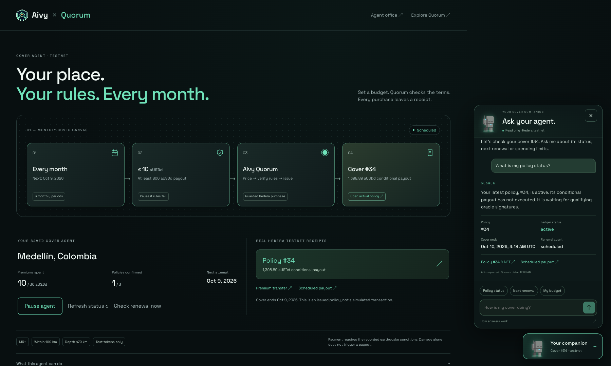

# Cover companion · September 10, 2026

**Live:** [Aivy canvas → Ask your agent](https://aivylabs.xyz/quorum).
The animated companion reads the current browser's latest policy. The recorded
session uses [existing policy #34](https://quorum.aivylabs.xyz/policy/34).

| Check | Result |
| --- | --- |
| Real AI | Typed status and action questions returned `source: ai` from the deployed OpenAI integration. Quick questions returned `source: quick`. |
| Current policy | Hedera Mirror Node confirmed #34 active, with no executed payout. The answer linked the actual policy and schedule. |
| Actions | A request to pause and transfer tokens only displayed guidance to use the canvas controls. No transaction tool exists in chat. |
| Ownership | Anonymous status returned onboarding and no policy links. A client-supplied policy ID was rejected with HTTP 400. |
| State preservation | The complete authenticated mandate was identical before and after chat checks. The VPS mandate journal checksum also stayed unchanged through deployment and checks. |
| Responsive UI | Seven fixture viewports: 1800×1080, 1440×1000, 1024×1000, 768×1000, 390×900, 320×800 and 844×390. Live checks at 1800, 390 and 320 px. No overflow or page errors. |
| Interaction | Close button, launcher toggle, Escape and outside click work. Outside links still navigate. Action guidance does not submit a mutation. Error and reduced-motion cases passed. |
| Regression | 142 Quorum backend tests passed. Aivy frontend build passed, plus the existing canvas consent/receipt/pause/reload checks at five widths. The older Aivy backend's documented baseline failures remain separate. |
| Deployment | Backend `20cdf18`, frontend `f46350a`, pushed to both main branches and deployed to the VPS. Existing Aivy office backend and oracles were not restarted. |

[Live response evidence](../evidence/cover-companion.json) ·
[Short screen recording](https://quorum.aivylabs.xyz/demo-video/aivy-cover-companion.mp4) ·
[Architecture and safeguards](../COVER-AGENT.md#ask-your-agent-without-granting-it-spending-power).

The screenshots, responses and clip are real reads, not fixtures. Network status
and dates are capture-time observations. No new policy, pause, transfer or mainnet
transaction was submitted for these checks. Conversations and private capabilities
are excluded from public evidence; the JSON contains the read-only server answers.
