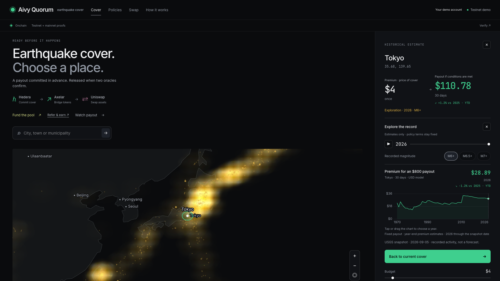

# Historical exploration beside the map

“Explore data” now opens in the right-hand column, directly below the selected
location’s premium/payout estimate. The chart appears before budget controls and
expanded explanations. With no location selected, the same column offers the
timeline and a prompt to choose a place. Phones and tablets stack the panel below
the compact map; opening it brings the location details into view.

The map, quote estimate, year slider and chart share one timeline state. The chart
still compares premiums for a fixed **$800 modeled payout**, with red/green annual
variation. Exploring history submits no transaction and cannot change an issued
policy. Returning to cover restores the latest snapshot and M6+ quote.

## Verification — September 7, 2026

- Production TypeScript/Vite build passes.
- Browser checks at **320, 390, 768, 900, 1024, 1440 and 1920 px**: no horizontal
  overflow, right-hand placement above 900 px, stacked placement below it, and
  history directly after the location estimate.
- Chart click/drag, touch selection, keyboard arrows/Home/End/PageUp, year slider,
  magnitude filters and play/pause keep the estimate and selected year aligned.
- Playback stops at the latest year; manual year selection pauses playback.
- Selecting a place after opening the empty panel retains the year/magnitude.
  Closing the quote returns to the empty exploration panel without losing them.
- Duration changes recalculate the fixed-payout premium. Closing exploration or
  returning to cover resets to the latest year/M6+, and restores keyboard focus
  to “Explore data”. Escape closes history without discarding the selected place.
- Zero browser runtime errors in the seven-width check. API writes were blocked
  during QA; these checks created no accounts, policies or ledger transactions.

Desktop and phone screenshots were visually reviewed. These are focused Chromium
checks, not exhaustive certification across browsers or devices.
