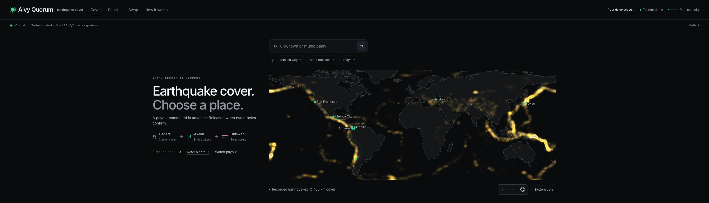

# Large-screen map

The landing map now fits comfortably on large monitors. It previously expanded
with the entire screen width, magnifying labels and pushing the world below the
initial viewport.

## What changed

| Before | Now |
| --- | --- |
| Introduction above an ever-wider map | From 1200 px, introduction beside a centered map bounded by both available width and height |
| Quote selection retained the full introduction above the map | Selected map beside the quote and its Explore data controls |
| Labels, dots and outlines grew with the map | Consistent screen-sized labels, markers and outlines; geographic coverage still scales accurately |
| Heat bitmap fixed at 2760 × 1058 | Canvas sized to its actual rendered area and pixel density, capped at 2× |
| Search removed the demo-place row and shifted the map | Its space is preserved while the search menu is open |
| Zoom controls could cover Tokyo on phones | Compact controls below the geography |
| Dragging a marker opened a policy | Drag pans; a click or keyboard activation opens the policy |

The heat layer and SVG share the same uniform fit, including mobile letterboxing.
Resizing redraws the heat field without resetting the selected place or history
year. The available height follows the actual navigation and onchain panel height.
Phone layouts remain stacked. Blank margins around the map ignore
clicks; offscreen policy markers are removed from keyboard navigation. Escape
closes an open search before dismissing the quote.

## Verification · September 8, 2026

- TypeScript and production build passed.
- Whole landing map and legend visible at **1600 × 900, 1920 × 1080,
  2560 × 1440, 3440 × 1440 and 3840 × 2160**.
- Follow-up review checked **1366 × 768, 1440 × 900, 1599 × 900, 1600 × 900,
  1920 × 800, 2560 × 900, 2732 × 786, 3440 × 900 and 5120 × 1440**.
  Each landing page fits its viewport; opening search moves neither the input
  nor the map. The original 2732 × 786 case needed 1019 px of page height.
- Retina rendering checked at 1728 × 1117 with 2× density; 390 px mobile at 3×
  density correctly uses the 2× rendering cap. Labels measure 12 CSS pixels.
- Tokyo selection, Medellín search, zoom, world reset and resize between desktop
  and mobile passed. The selected historical year and visible heat survive resize.
- Actual public policy snapshots exercised marker click, keyboard activation,
  dragging, right-click, blank-margin clicks and search dismissal at five desktop,
  Retina and phone sizes. No testnet writes were made. Header expansion and
  collapse correctly resize the map at 1200 × 768 and 2732 × 786.
- History click, drag, keyboard, playback and magnitude controls passed at seven
  widths from 320 to 1920 px; the chart stays beside the quote on desktop.
- **54 responsive page views** across 320–1440 px had no horizontal overflow or
  uncaught browser errors. Desktop, ultrawide and phone screenshots were inspected.

These checks use read-only API requests; no demo accounts or ledger transactions
are created for layout testing.

Implementation: [layout](../../ui/src/styles.css),
[map](../../ui/src/app/AtlasMap.tsx), [heat](../../ui/src/beats/atlas/Heat.tsx).
