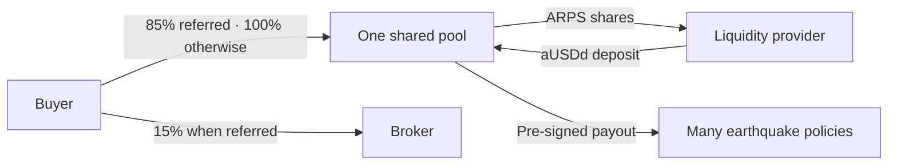

# Platform QA — September 7, 2026

**Verdict: the demonstrated testnet flows are working; the investment product is still a prototype.**
QA is complete for the scope below, with wallet-browser and operational limits explicitly retained.

## What the business actually does

- **One shared pool.** Actual deposits issue fungible ARPS at the demo's fixed 1:1 rate.
- **Per-policy cards are estimates.** They do not create isolated vaults or LP NFTs.
- **ARPS percentage is share supply ownership**, not a guaranteed yield or NAV valuation.
- **No LP earnings distributions, redemption, withdrawals or ARPS market yet.** These are visible limits, not available buttons.
- A referred premium pays **85% to the pool / 15% to the broker**, without increasing the buyer's price. Otherwise 100% goes to the pool. There is no separate platform fee.

## Completed review

| Area | Evidence and result |
| --- | --- |
| Buyer | Medellín worldwide search and keyboard selection; valid quotes; real premium debit, NFT mint/delivery and terms receipts rechecked against Mirror Node. Isolated refused and interrupted requests show a safe next step. |
| Funding | Real 25 aUSDd deposit receipt rechecked; public account shows **25 ARPS / 0.0493%** of issued ARPS. Interrupted-response fixture recovers the original completed deposit and unlocks the form. |
| Broker | Broker action opens the account panel; clipboard-denied fallback exposes a valid copyable referral link. Actual 4 aUSDd premium split verified: **3.4 pool + 0.6 broker**, with unchanged buyer price. |
| Oracles | Policy #24 requested all three sources from the public UI. Each returned **no qualifying event**, paid **0.001 aUSDd**, with a successful matching receipt. No oracle signature or payout was claimed. |
| Cross-chain | The **HAK plugin-built transfer was delivered** on Sepolia, matched to the source token ID, sender, recipient and amount. Earlier real bridged-token and native ETH Uniswap swaps retain successful receipts. Live API quote/build checks pass. |
| Navigation | Home, cover/funding galleries, policy cover/estimate tabs, empty filters, missing policy, unknown route and all six story steps reviewed. Account closes by button, Escape and outside click. |
| Responsive UI | No horizontal overflow at **320 / 768 / 1280 px** across home with quote, funding, policy and galleries. All six story steps additionally checked at **1440 px**. Phone header compacted; no broken gallery image loads. |
| History | Fixed **$800 payout** basis; chart click, drag and keyboard update the year. Annual arrows/colors remain. Pointer interaction has no white outline. “Back to cover” restores current quoting. |
| Failure handling | Offline fixture disables deposits and labels estimates. Interrupted cover stays listed as a reserved request needing review; the quote panel no longer invites immediate retry. |
| Regression | **74/74 tests pass**; UI typecheck/production build passes. Existing large-bundle warning remains. Source and built HTML hashes matched the VPS deployment. |

[Business receipts](../evidence/business-flows.json) ·
[Live oracle checks and payments](../evidence/oracle-check-qa.json) ·
[HAK plugin delivery](../evidence/hak-axelar-plugin.json) ·
[Cross-chain swap evidence](../evidence/cross-chain-testnet.json).

## Fixes made during this audit

1. Added the missing **policy-bound manual oracle check** action, with pinned x402 recipients, 0.003 aUSDd maximum, shared cooldown, durable request IDs and inspectable receipts.
2. Corrected FDSN **HTTP 204 empty catalogues**. Empty/malformed HTTP 200 is unavailable; a source failure retains a confirmed payment receipt and never signs. Catalogue retries now share an 18-second budget.
3. Reconciled the initial failed QA check only after verifying its original exact token-transfer receipts. Preserved the original journal result; no payment was repeated or event verdict inferred.
4. Added exact-receipt reconciliation for interrupted deposits. Pending requests cannot trigger duplicate share issuance.
5. Clarified **You → shared pool → many policies**, toned down per-policy return labels, and kept unavailable income/exit features explicit.
6. Validated health responses before enabling writes, coalesced duplicate schedule reads, compacted the mobile header, and stopped rounding tiny oracle costs to zero in transaction history.
7. Updated README/submission/security documentation to reflect real swaps, the HAK Axelar integration and request-driven event checks.

## Coverage limits and demo preparation

- **Wallet browser:** the in-app browser has no injected EVM wallet. Missing-wallet guidance passed; actual wallet approval dialogs and uncertain-submission recovery were reviewed in code, not exercised interactively in this pass. Transaction validators have negative tests; real signed execution is recorded in the linked evidence.
- **Referral clipboard:** this browser denied clipboard writes; the manual-copy fallback passed. A clipboard-derived navigation was blocked by browser URL policy and was not retried. The real broker payment flow is separately evidenced on the ledger.
- **Oracle independence:** three catalogues and distinct keys, hosted by this project. This is not proof of three independent operators. Checks are requested, not autonomously monitored.
- **Networks:** live cover, ARPS, oracle x402 payments and bridge/swap tests use testnets. Mainnet settlement is a labeled recording; mainnet Uniswap prices are read-only previews.
- **External availability:** public catalogues, Mirror Node, Axelar delivery and Uniswap routing can be delayed. Keep receipts ready for the recording; unknown transfers require reconciliation, not retries.
- **Capacity:** verified pool headroom was about **176,272 aUSDd** during QA. Capacity and durable action/rate budgets are checked again before writes; this snapshot is not unlimited demo admission.
- **Performance:** the main UI bundle remains about 680 kB before gzip. Optional future work is splitting map/data code; it did not block the tested flows.

Before recording, use a wallet browser with Sepolia ETH, reuse the existing funded demo account,
and show one complete flow with receipts. Explain the shared-pool and testnet boundaries in the video.
