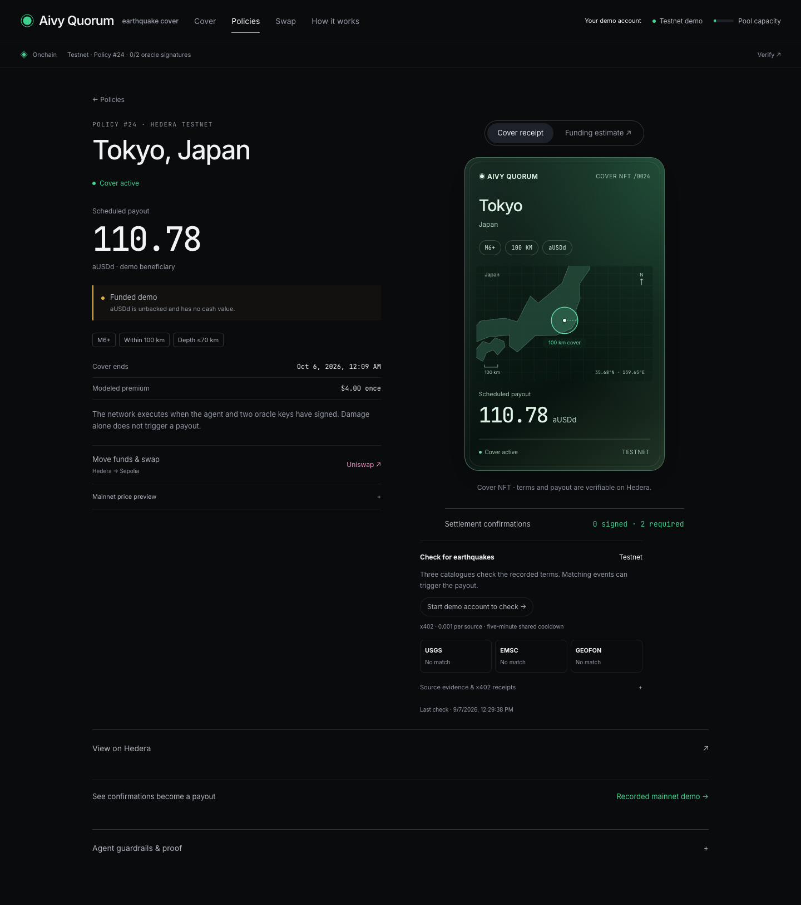

# Submission UX review · September 7, 2026

**Verdict: ready to record the demonstrated testnet flows. Freeze major features.**
The strongest story is **choose a place → commit cover → inspect the NFT → verify
the payout mechanism**, followed by **Hedera → Axelar → Uniswap**. The interface
should reveal those actions before explaining their implementation.

| Keep central | Keep secondary | Defer |
| --- | --- | --- |
| Geographic map and NFTs; interactive $800 payout history; six-scene mainnet replay | Per-policy economic estimates, mainnet price previews, detailed source logs | ARPS redemption/income distribution, new navigation destinations, additional wallet modes |
| Real managed-wallet swaps and Uniswap position actions | API routes, model assumptions, service custody and recorded receipts | Production custody, independent oracle operators and autonomous monitoring |

The last column is a product boundary, not functionality being removed. Separate
Uniswap positions already support fee collection and withdrawal; ARPS does not.

## Polish delivered

| Friction found | Change |
| --- | --- |
| Budget and duration appeared after purchase | Configure first, then create cover. The actual testnet payout sits beside the modeled amount. |
| City names overlapped or became tiny on phones | Labels resize, avoid one another and zoom controls, and reserve space for the selected location. Legend symbols stay with their labels. |
| Mobile policy identity appeared below its details | Location and status now lead both cover and funding views. |
| Oracle history filled the policy page | Three compact source results; verdicts, x402 payments and signatures expand together. The last-check time stays visible. |
| Funding assumptions repeated before the action | One model/limitations disclosure; capital at risk, preview status and both outcomes remain visible. Comparison bars align across wrapped labels. |
| ARPS balance had no direct onward action | **Pool shares ↗** opens the actual pool position. |
| Escape could dismiss the quote behind a popup | Account/pool menus dismiss independently; pool menus also close on outside click. |
| Prior receipts could look like the new quote’s result | Completed actions are explicitly labeled “Latest swap/liquidity action/delivery”; a prepared quote remains a separate action. |
| Mobile payout amounts were far apart | The pool debit and beneficiary credit now sit side by side. |
| Old quotes failed only after a click | Swap and LP reviews show expiry and offer refresh before execution. The signer still independently rejects expired requests. |
| Gas and wallet setup copy repeated | One shared wallet explanation; essential testnet/custody boundaries and receipts remain. The preparation error no longer suggests a removed external-wallet path. |

## Evidence

- **54 Chromium layout checks:** nine routes/views at 320, 390, 768, 900, 1024
  and 1440 px, with no horizontal overflow or browser exceptions. Desktop and
  phone screenshots were visually inspected. Another 27 focused checks covered
  map controls, policy identity, aligned outcome bars and every story scene at
  1440, 390 and 320 px. The seven-width historical-chart regression also passed.
- **89 tests pass**, including signer, transaction validation and recovery tests;
  TypeScript and the production build pass. The existing bundle warning remains
  (main JS approximately 667 kB before gzip).
- Current Uniswap Trading API quote loaded for an existing managed demo wallet.
  An injected-wallet trap recorded zero extension access.
- Browser flows covered quote controls, worldwide Medellin search, gallery/detail
  navigation, all six story scenes, Onchain evidence tabs, live x402 receipts,
  missing-page recovery, account dismissal and the ARPS shortcut.
- Isolated expiry fixtures proved that an expired swap/LP review refreshes rather
  than submitting. API writes were blocked; this UX pass created no accounts,
  policies or ledger transactions. Quote preparation is not swap execution.
- [Nine published receipts rechecked](../evidence/readiness-recheck.json) against
  the current Hedera mirrors/Sepolia RPC: premium, NFT mint/delivery, pool deposit,
  Axelar delivery, managed swap, position mint/exit and the mainnet scheduled payout.
  These are existing executed transactions, not new executions in this pass.
- Service snapshot: testnet writes enabled; all three oracle discovery endpoints
  returned HTTP 200. Three funded Sepolia wallets were unallocated, none funding,
  with zero pending wallet actions. Sponsor held about 0.0272 Sepolia ETH,
  8.52 aUSDd and 13.28 test USDC. Budgets and balances are time-dependent.

## Recording boundary

Use the public HTTPS app and one persistent browser session. Show a real receipt
for each demonstrated transaction; cut waiting time transparently. Bridge delivery
depends on Axelar and may need its sponsored completion action. Starter tokens
allow a separate swap demonstration while a bridge is in transit.

Keep **testnet actions**, **recorded mainnet settlement**, **mainnet quote-only
previews**, and **proposed policy economics** distinct. Policy payouts go to their
fixed demo beneficiary; the bridge uses the visitor's separate demo balance.
Checks are manually requested, and demo keys share an operator host. No production
investment readiness or prize eligibility is implied by this UI review.

See the [recording guide](../SUBMISSION.md), [agent security](../AGENT-SECURITY.md),
[managed-wallet execution evidence](MANAGED-DEMO-WALLETS.md) and
[historical chart checks](EXPLORE-SIDEBAR.md).
