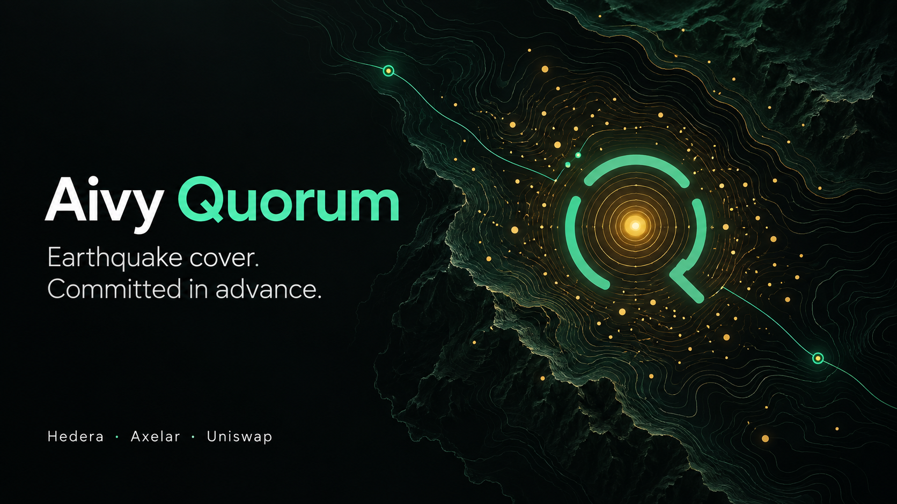
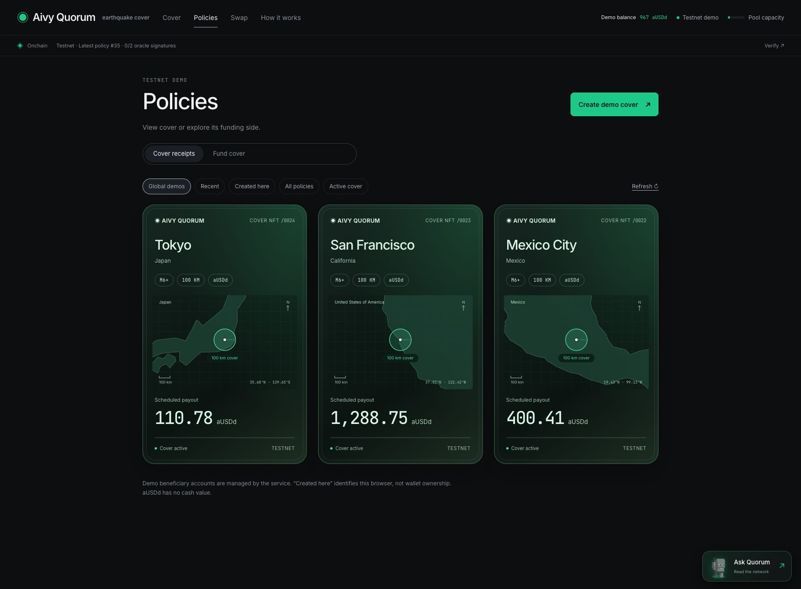

# Submission artwork and screenshots

Created and captured September 10, 2026, Bogotá time (September 11 UTC).
Uploaded to the signed-in ETHOnline draft for **Aivy Quorum**, with the personal
`jmgomezl/aivy-parametric-pool` repository attached.



| Asset | File | Scope |
| --- | --- | --- |
| Logo | [Square PNG](logo-quorum.png) | Mint quorum arcs and a gold epicenter on an opaque dark tile |
| Cover | [Wide PNG](cover-quorum.png) | Abstract topographic artwork, product name and integration names |
| Screenshot 1 | [Cover NFTs](media/03-cover-nfts.jpg) | Existing testnet geographic receipts |
| Screenshot 2 | [Mainnet settlement](media/04-mainnet-settlement.jpg) | Labeled replay of the controlled September 4 experiment |
| Screenshot 3 | [Blocky402](media/05-blocky402-receipts.jpg) | Existing oracle payments; payment alone does not prove payout approval |
| Screenshot 4 | [Uniswap swap](media/06-uniswap-swap.jpg) | Wallet-free entry and explicitly recorded cross-chain receipts |
| Screenshot 5 | [Uniswap liquidity](media/07-uniswap-liquidity.jpg) | Current pool balances, operator seed NFT and demo controls |
| Screenshot 6 | [Monthly agent](media/08-monthly-companion.jpg) | Saved mandate, issued policy 35 and read-only companion status |

Extra captures: [global map](media/01-atlas.jpg), [Tokyo quote](media/02-quote.jpg).
Earlier `logo.png` / `logo.svg` and the general `docs/media/` gallery remain as
historical assets; they are not the new submission selections.

## Screenshot provenance

Screenshots came directly from the deployed Quorum and Aivy websites through
Codex's CUA browser screenshot API, using the existing 1720 × 1267 viewport.
The Blocky402 image is a direct browser clip of the evidence panel. No screenshot
was retouched, composited, generated or resized. The `.jpg` extension matches the
browser's JPEG output. Only navigation, viewing and a read-only companion query
were used: no new mint, payment, swap, liquidity position or renewal was executed
for this capture session. Previously recorded receipts retain their UI labels.

[Exact source URLs, UTC capture times and scope](media/captures.json) ·
[SHA-256 file checksums](media/SHA256SUMS)



## Generated artwork provenance

**Mode:** Codex built-in `image_gen.imagegen`, two new-image generations and one
referenced-image edit of the logo. No CLI fallback or external image source.
The logo and cover are AI-generated artwork; they are separate from the real
screenshots. The topographic cover is illustrative, not a geographic risk map.
The logo edit removed transparency and the dark halo after reviewing its
appearance against the submission form's white background.

### Logo generation prompt

```text
Use case: logo-brand. Create a finished square 1024x1024 icon for Aivy Quorum, a verifiable earthquake cover product. Match the app's minimal near-black, mint green and warm gold visual identity. One striking geometric symbol centered with generous margins: a precise circular Q made of three broad mint arc segments, a subtle diagonal Q tail at lower right, and one small warm-gold epicenter dot in the center. The three segments suggest quorum confirmations, the dot suggests a protected location. Flat vector-like edges, perfectly balanced geometry, near-black solid background #090c0c. Strong legibility at 32px, premium restrained fintech design. No words, no letters other than the abstract Q shape, no slogan, no gradients, no 3D, no mockup, no border, no extra decorative dots, no watermark. Deliver only the square logo artwork.
```

### Final logo edit prompt

```text
Edit this existing Aivy Quorum logo for a hackathon project icon. Preserve its exact mint segmented Q geometry, centered gold epicenter dot, size and placement. Make the entire square canvas a completely opaque, solid near-black background #090c0c, edge to edge, including every corner, and make the inside of the Q the same opaque black. This is a black square app tile, not a transparent cutout. Remove the blurry black/gray halo and any bright glow; use clean, flat mint and gold edges. Absolutely no transparency, no alpha cutout, no white background, no text, no added objects. The final image must look like a crisp mint-and-gold Q printed on a solid black square.
```

### Cover generation prompt

```text
Use case: ads-marketing. Create a finished premium hackathon project cover image for Aivy Quorum, wide 16:9 at 1920x1080 or 2048x1152. Match a beautiful minimalist earthquake-cover web app: near-black #090c0c background, mint #3fcf8e accents, warm gold #e3b341 seismic details, white typography. Editorial layout: large crisp left-aligned title 'Aivy Quorum' in the left third; directly underneath, two understated lines 'Earthquake cover.' and 'Committed in advance.' Left lower third small typography 'Hedera · Axelar · Uniswap'. The right half has a beautiful abstract cartographic relief: fine topographic contour lines sweeping through darkness, a single warm-gold epicenter surrounded by three mint quorum arcs that create a protective Q-like ring. The region is abstract, not a real hazard map, no city labels, not a screenshot. Subtle gold seismic points fade outward and one or two very thin mint paths communicate verifiable connections. Quiet dimensional depth and fine luminous linework, large negative space, sophisticated restrained typography. All text must be precisely as quoted, spelling 'Aivy Quorum' correctly. Keep all text within generous 8% safe margins and easily readable at thumbnail size. No claims about licensing or insurance guarantees. No stock disaster photo, no wallets, no fake UI, no fake transactions, no badges, no watermark, no extra text. Deliver only the finished wide cover artwork.
```

Final delivered dimensions: logo **1254 × 1254**, cover **1672 × 941**.
The cover is approximately 16:9; dimensions above reflect the actual tool output.
See [AI assistance disclosure](../AI-ASSISTANCE.md).
